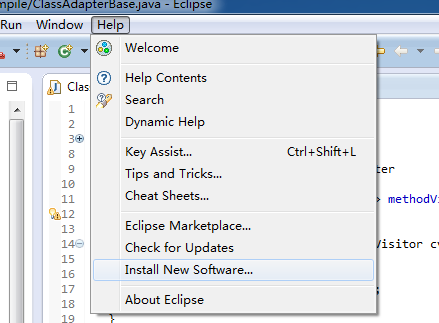
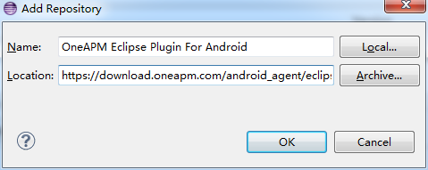
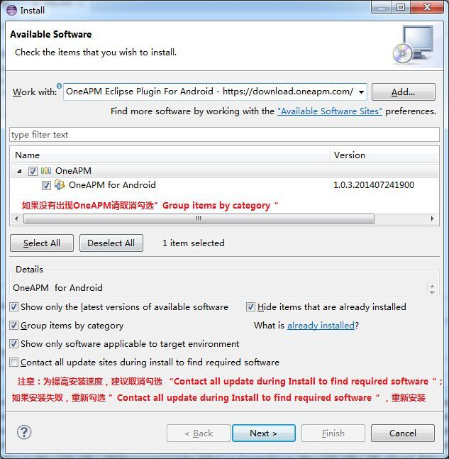

# Android SDK - Eclipse 插件安装方法

## 1. 安装 SDK

* 第一步：打开 Eclipse

* 第二步：菜单 Help->Install New Software

* 第三步：添加 OneAPM Android 的 Eclipse 插件源

Eclipse 4.4 之前的版本，请使用：

`https://download.oneapm.com/android_agent/eclipse_lt_4.4/`

Eclipse 4.4 及之后的版本（需要 JDK 1.8），请使用：

`https://download.oneapm.com/android_agent/eclipse_gt_4.4/`

* 第四步：执行添加如下图

**提示**：取消勾选 Contact all update during Install to find required software 会提高安装的速度；如果安装失败，重新勾选 Contact all update during Install to find required software，等待安装完成。

## 2. 安装 Agent 到 Project