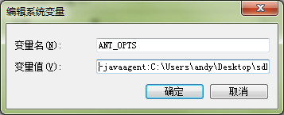

# Ant安装方式

## 1. 配置 Ant

* 第一步：下载最新的 OneAPM Android SDK

* 第二步：添加 oneapm-android-agent.jar 到工程 libs 目录中，如果项目中没有 libs 目录，请创建一个新的 libs 目录

* 第三步：设置 ANT_OPTS 环境变量

**Mac OS / Linux 环境**

`export ANT_OPTS="-javaagent:/path/to/oneapm/class.rewriter.jar"`

**Windows 环境**

* 方法一：“在我的电脑右键->属性->高级系统设置->环境变量->添加环境变量”，如下图: 



其中 “/path/to/oneapm/”请用你实际存放 OneAPM 的 class.rewriter.jar 的路径替换。

不要放在工程的 libs 目录中！

* 方法二：在命令行中设置

`set ANT_OPTS="-javaagent:/path/to/oneapm/class.rewriter.jar"`

**注意**：请勿将该环境变量 ANT_OPTS 永久设置到用户或系统环境变量里，否则会影响其他不需要进行嵌码的 Android 项目。建议在单次编译的命令行状态下临时设置该环境变量，或单独在需要嵌码项目的批处理编译脚本中设置该环境变量。

## 2. 设置 App 权限

构建完成后，请在待监测的 App 工程的 AndroidMainfest.xml 文件中增加以下的权限：

```xml
<uses-permission android:name="android.permission.INTERNET" />
<uses-permission android:name="android.permission.ACCESS_NETWORK_STATE" />
<uses-permission android:name="android.permission.READ_PHONE_STATE" />
```

若想使用 Crash 快照功能，请引入以下授权信息：

```xml
<uses-permission android:name="android.permission.GET_TASKS" />
```

如果使用基站定位，请添加如下权限：

```xml
<uses-permission android:name="android.permission.ACCESS_COARSE_LOCATION" />
```

## 3. 配置 Agent

* 第一步：在应用的主 Activity 的 class 中，添加

```java
import com.blueware.agent.android.BlueWare;
```

* 第二步：在 onCreate 方法中，添加

```java
BlueWare.withApplicationToken(
"<use app token created at step 1>")
.start(this.getApplication());
```

**注意**：APIKey 由 OneAPM 分发，每个应用对应一个唯一的 APIKey。

## 4. 生成 build.xml

* 第一步：设置混淆器

如果 App 使用 ProGuard 工具来优化发布的 Apk 包，为了保证 App 监测 SDK 可以正常使用，请在所属项目的 proguard.cfg文件中加入以下的内容：

```
-dontwarn org.apache.commons.**
-keep class org.apache.http.impl.client.**
-dontwarn org.apache.commons.**
-keep class com.blueware.** { *; }
-dontwarn com.blueware.**
-keepattributes Exceptions, Signature, InnerClasses
```

注意：如果您希望保留行号信息，建议您在 proguard.cfg 中添加如下代码：

```
- keepattributes SourceFile ,LineNumberTable
```

* 第二步：使用 Ant 重新编译并安装 App，在项目根目录下运行：

`ant clean release install`

静候 5 分钟后，若无应用程序相关性能数据展现，或安装过程中出现问题：请联系 OneAPM 客服人员：

* 技术咨询热线： 400-622-3101

* 销售咨询热线： 400-659-1230

* OneAPM 客服邮箱：support@oneapm.com
