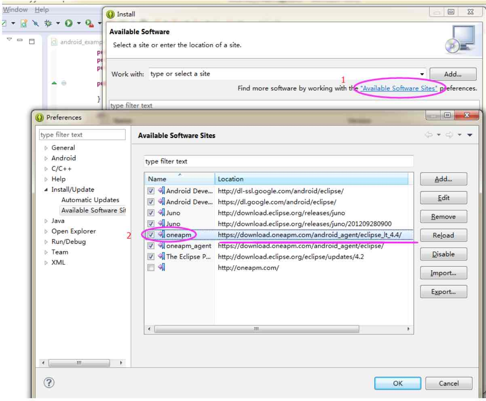

# Eclipse 安装 SDK 提示“The chosen operation is not currently available”

## 故障说明

错误提示：The chosen operation is not currently available 

## 解决方案

* 查看开发工具 Eclipse 版本，去 Eclipse 的安根目录找到.eclipseproduct 打开查看 Eclipse 版本 

* 菜单 Help->Install New Software

* 点击 Available Software Sites

* 查看安装的 SDK 版本是否和 Eclipse版本是否匹配，如果不匹配，请卸载掉，重新安装 SDK

* 参考如下

Eclipse 4.4 之前版本请使用以下链接：

https://download.oneapm.com/android_agent/eclipse_lt_4.4/

Eclipse 4.4 及之后版本请使用以下链接：

注：OneAPM Eclipse 4.4 插件需要 JDK 1.8。

https://download.oneapm.com/android_agent/eclipse_gt_4.4/