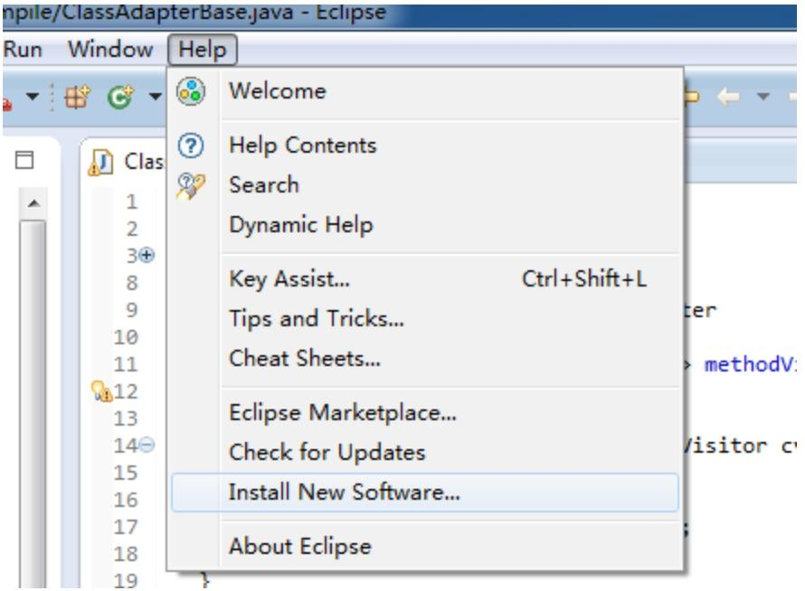
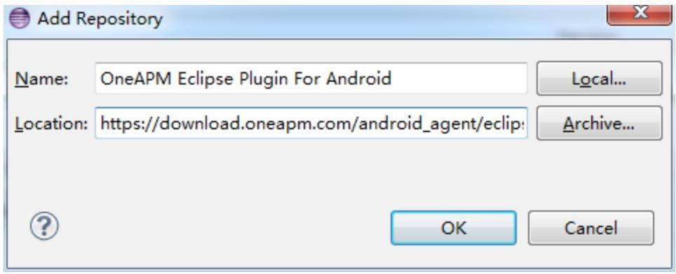
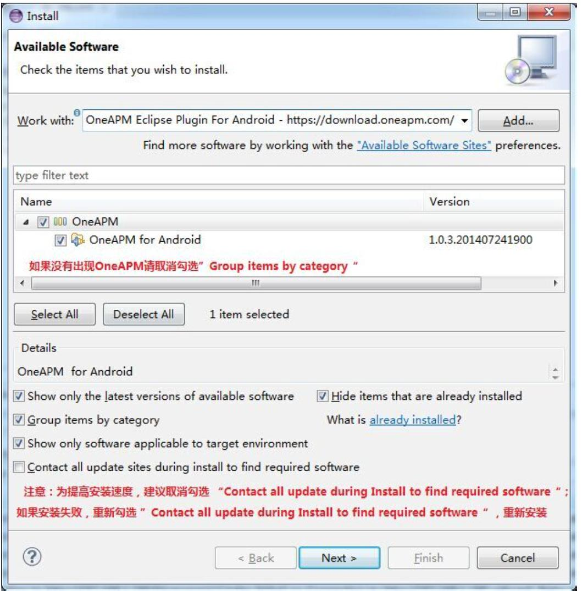
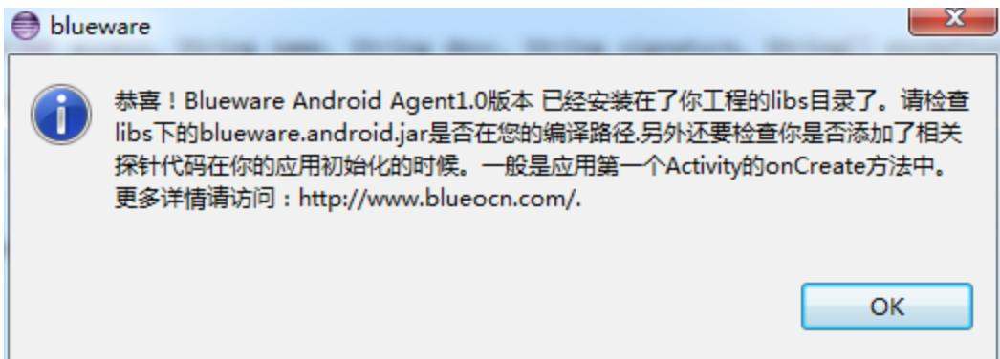

# Eclipse 插件安装方法

## 1. 安装 SDK

OneAPM Android SDK支持在 Eclipse 集成开发环境中直接使用和部署。

**1. 查看 Eclipse 版本号**

OneAPM Eclipse 插件支持 Eclipse 3.8 及以上版本，请于安装前确认您使用的 Eclipse 版本号：

Mac OS 下
         点击进入“关于 Eclipse”
Windows 下
         点击进入“About Eclipse”或者是“About ADT”
         
(1)点击Help, 打开 “关于 Eclipse” 可查看当前版本号

   
   

(2)如下图所示, 红色方框内的版本号信息.(如未见详细版本号,可点击进人“Eclipse Plugin”查看,详见步骤)


(3)如果您的eclipse版本号在上图中没有出现, 可以点击上图中的底部 Eclipse 图标,点击后弹出对话框, 如下图所示:


* 第一步：打开 Eclipse

* 第二步：菜单 Help->Install New Software



* 第三步：添加 OneAPM Android 的 Eclipse 插件源

Eclipse 4.4 之前的版本，请使用：

`https://download.oneapm.com/android_agent/eclipse_lt_4.4/`

Eclipse 4.4 及之后的版本，请使用：

`https://download.oneapm.com/android_agent/eclipse_gt_4.4/`



* 第四步：执行添加如下图



**提示**：取消勾选 Contact all update during Install to find required software 会提高安装的速度；如果安装失败，重新勾选 Contact all update during Install to find required software，等待安装完成。

## 2. 安装 Agent 到 Project

* 第一步：新建或者在已有 Android Project 工程右键会出现如下：
 


* 第二步：执行安装 OneAPM 插件会自动复制 OneAPM Agent 的 jar 包到工程的 libs 目录。安装成功如下：



**注意**：查看 Android 工程的 libs 目录中，是否有 oneapm-android-agent.jar 文件，如果没有请刷新 libs 目录。

## 3. 配置 Agent

* 第一步：在项目工程右键 Build Path Configure Build Path 将 oneapm-android-agent.jar 添加到系统的 Build Path 中；


* 第二步：在应用的主 Activity 的 class 中，添加

```java
import com.blueware.agent.android.BlueWare;
```

* 第三步：在 onCreate 方法中，添加

```java
BlueWare.withApplicationToken(
"<use app token created at step 1>")
.start(this.getApplication());
```

**注意**：APIKey 由 OneAPM 分发，每个应用对应一个唯一的 APIKey。

## 4. 配置 App 权限

* 第一步：在待监测的 App 工程的 AndroidMainfest.xml 文件中增加以下的权限

```xml
<uses-permission android:name="android.permission.INTERNET" />
<uses-permission android:name="android.permission.ACCESS_NETWORK_STATE" />
<uses-permission android:name="android.permission.READ_PHONE_STATE" />
```

若想使用 Crash 快照功能，请引入以下授权信息：

```xml
<uses-permission android:name="android.permission.GET_TASKS" />
```

如果使用基站定位，请添加如下权限：

```xml
<uses-permission android:name="android.permission.ACCESS_COARSE_LOCATION" />
```

**注意**：如果应用使用 progurd 混淆，请按如下方式配置

```
-dontwarn org.apache.commons.**
-keep class org.apache.http.impl.client.**
-dontwarn org.apache.commons.**
-keep class com.blueware.** { *; }
-dontwarn com.blueware.**
-keepattributes Exceptions, Signature, InnerClasses
```

注意：如果您希望保留行号信息，建议您在 proguard.cfg 中添加如下代码：

```
- keepattributes SourceFile ,LineNumberTable
```

静候 5 分钟后，若无应用程序相关性能数据展现，或安装过程中出现问题：请联系 OneAPM 客服人员：

* 技术咨询热线： 400-622-3101

* 销售咨询热线： 400-659-1230

* OneAPM客服邮箱：support@oneapm.com
