# Eclipse 插件安装方法

##1.命名你的应用程序 
点击进入OneAPM Mobile Insight[集成安装界面](https://mi.oneapm.com/mobile/app/setup#/)，命名应用程序。

OneAPM Android SDK支持在 Eclipse 集成开发环境中直接使用和部署。

## 2. 查看 Eclipse 版本号

OneAPM Eclipse 插件支持 Eclipse 3.8 及以上版本，请于安装前确认您使用的 Eclipse 版本号：

Mac OS 下
         点击进入“关于 Eclipse”
Windows 下
         点击进入“About Eclipse”或者是“About ADT”
         
(1)点击Help, 打开 “关于 Eclipse” 可查看当前版本号

   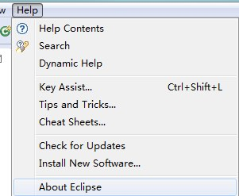
   

(2)如下图所示, 红色方框内的版本号信息.(如未见详细版本号,可点击进人“Eclipse Plugin”查看,详见步骤(3)。)
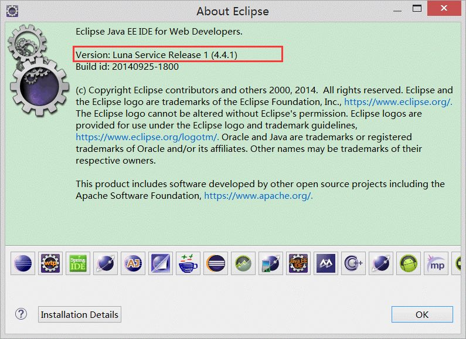

(3)如果您的eclipse版本号在上图中没有出现, 可以点击上图中的底部 Eclipse 图标,点击后弹出对话框, 如下图所示:

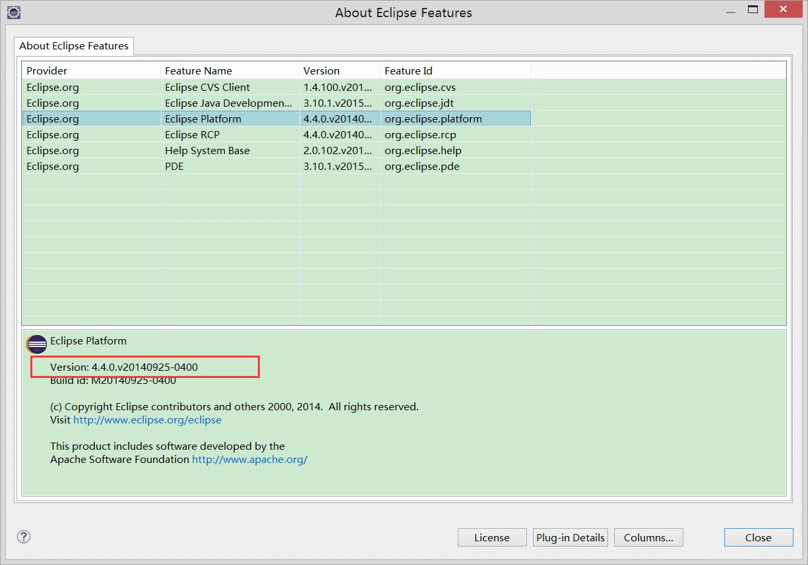


### **3.安装 OneAPM Eclipse 插件**

（1）在 Eclipse 集成开发环境中点击“Help”菜单，选择“Install New Software...”

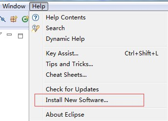
（2）点击Work with项右侧的“Add…”按钮来增加 OneAPM Eclipse 插件.
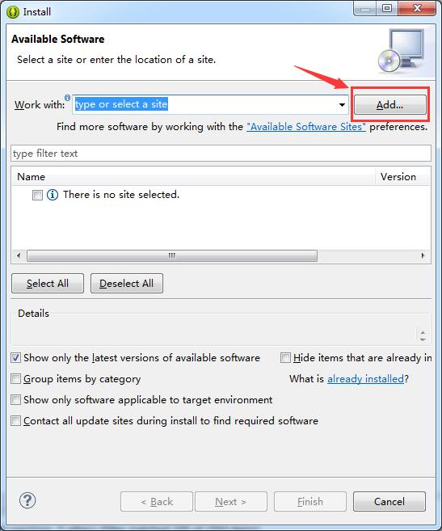

（3）设置插件的名称（比如OneAPM）以及URL地址:
 Eclipse 插件需要 JAVA_HOME 环境变量，目前已支持最新 4.4 版本 Eclipse。
 Eclipse 4.4 及之后版本请使用以下链接：   
      
     ``` 
     https://download.oneapm.com/android_agent/eclipse_gt_4.4/
     ```

*注：OneAPM Eclipse 4.4 插件需要 JDK 1.8。*
 
 Eclipse 4.4 之前版本请使用以下链接：
 
     ```
     https://download.oneapm.com/android_agent/eclipse_lt_4.4/
     ```
 
 例如, Eclipse 4.4版本就可使用
    
      ```
      https://download.oneapm.com/android_agent/eclipse_gt_4.4/
      ```
    
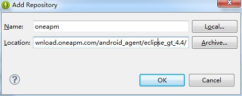

(4)在Work with选项中选中刚才添加的资料库，在下方列表中点击“Select All”选中所有的插件。点击“Next >”到下一步。

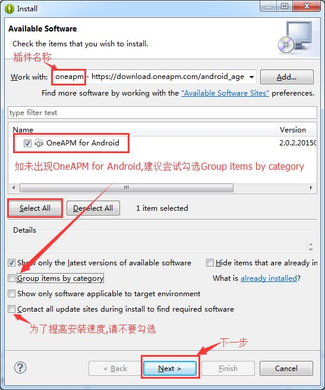

(5)查看插件描述并点击“Next >”进入下一步。

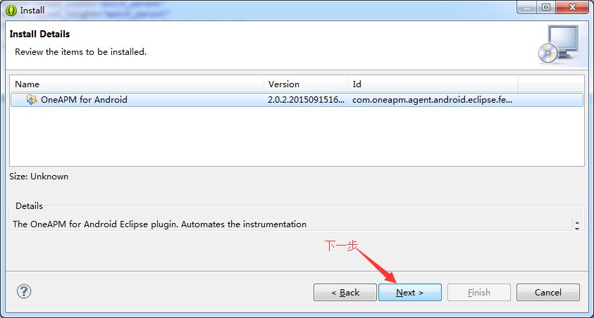

(6)查看许可协议，选择“I accept the terms of the license agreement”，点击“Finish>”进入下一步。

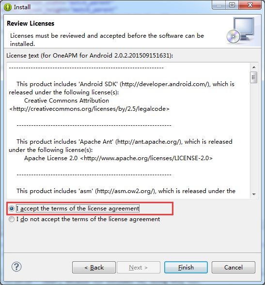

(7)选择信任插件的签名证书，点击“OK”。

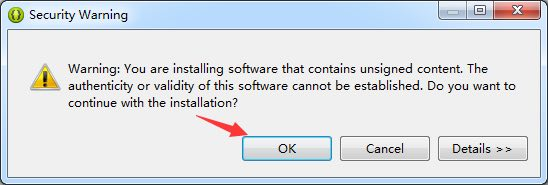
(8)点击“Yes”重启 Eclipse 来完成插件的安装。

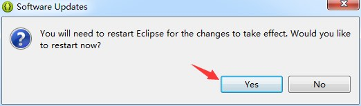

(9)插件安装完成后，右击需要监控的App，选择“安装OneAPM”

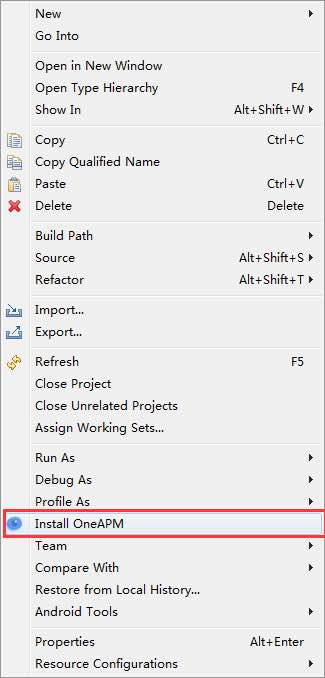

Eclipse 会自动添加“oneapm-android-agent.jar”包到libs目录下，若没有libs目录请新建一个。


*注：Eclipse 插件目前只支持JDK（1.5 - 1.8）运行环境（不支持只有JRE的运行环境）
Window 安装Eclipse插件时，请在没有空格和特殊字符的路径安装JDK
Eclipse 插件需要使用JAVA_HOME环境变量，请检查环境变量,如果提示SDK 安装后提示错误信息：
由于使用 JRE 运行 Eclipse 导致 OneAPM 无法正确加载，请参考链接：* 

```
https://oneapm.kf5.com/posts/view/48050/
```

## 4. 配置授权信息

确保应用程序的 AndroidManifest.xml 配置文件中，引入了以下授权：

```
<!--发送性能数据到服务器需要该权限--> 
<uses-permission android:name="android.permission.INTERNET" /> 
<!--发送性能数据到服务器需要该权限--> 
<uses-permission android:name="android.permission.ACCESS_NETWORK_STATE" /> 
<!--sdk读取设备识别码需要该权限--> 
<uses-permission android:name="android.permission.READ_PHONE_STATE" /> 
<!--【非必选】若想知道 Crash 的时候，后台有哪些任务运行，请引入该权限--> 
<uses-permission android:name="android.permission.GET_TASKS" />
```
注意：如果您的应用使用 proguard 混淆，请配置以下：

```
-keep class org.apache.http.impl.client.** 
-dontwarn org.apache.commons.** 
-keep class com.blueware.** { *; } 
-dontwarn com.blueware.** 
-keep class com.oneapm.** {*;} 
-dontwarn com.oneapm.** 
-keepattributes Exceptions, Signature, InnerClasses
```

注意：如果您希望保留行号信息，建议您在 proguard.cfg 中添加如下代码：

```
-keepattributes SourceFile, LineNumberTable
```
## 5.WebView性能监控（可选）
如果你需要开启此功能，请参考 [Webview性能监控说明](https://oneapm.kf5.com/posts/view/45662/?_ga=1.179193379.624652157.1461721958) 。
## 5. 用户信息配置（可选）
顾名思义，就是说和每一个用户相关联的数据信息。例如崩溃的时候可以根据这个配置查询是哪一个用户发生了崩溃。如下：

```
// 附加数据 
HashMap<String,String> extraData = new HashMap<String, String>(); 
String userTel = "15801388723"; 
extraData.put("tel", userTel); 
extraData.put("userId", "888"); 
extraData.put("email", "88888@qq.com"); 

ContextConfig config = new ContextConfig(); 
String searchValue = userTel; 
config.setSearchValue(searchValue); // 设置一个搜索值 
config.setExtra(extraData); 

OneApmAgent.init(this.getApplicationContext()).setContextConfig(config).setToken("---<YOU TOKEN HERE>---").start(); 
```
## 6. 集成统计分析功能（可选）
在每个 Activity 中导入 OneApmAnalysis 类
``` 
import com.oneapm.agent.android.module.analysis.AnalysisModule; 
```
在每个 Activity 的 onResume() 方法中添加代码:
```
AnalysisModule.onResume();
```
如下示例代码：
```
@Override
protected void onResume() {
  super.onResume();
  AnalysisModule.onResume();
}
```
在每个 Activity 的 onPause() 方法中添加代码:
```
AnalysisModule.onPause();
```
如下示例代码：
```
@Override
protected void onPause() {
  super.onPause(); 
  AnalysisModule.onPause();
}
```
配置渠道信息:
如果您的app需要增加渠道信息请在AndroidManifest.xml的Application标签内添加如下（请把YOU CHANNEL替换成您自己的发布渠道例如豌豆荚、360等）
```
<meta-data android:name ="BluewareChannel" android:value="YOUR CHANNEL" />
```
注意：如果两个Activity是继承关系，只需要在父Activity添加即可，如果在两个Activity中同时添加，则会造成重复统计。
## 7. 功能开关（可选）
如果您想使用帧率监控功能可以配置如下代码开启帧监控功能

```
PerformanceConfiguration.getInstance().setEnableFps(true);
```

## 8.启动Agent

在默认启动的 Activity 中 import OneApmAgent类
```
import com.oneapm.agent.android;
```
在App的第一个Activity的 onCreate() 方法中加入如下调用代码来初始化 OneAPM（其中包含了在步骤 2 中根据应用程序名称而生成的授权编号）
```
OneApmAgent.init(this.getApplicationContext()).setToken("---<YOU TOKEN HERE>---").start();
```
或如果设置了用户信息（第5步），初始化代码如下（config是类似第5步中的用户信息配置）

```
OneApmAgent.init(this.getApplicationContext()).setContextConfig(config).setToken("---<YOU TOKEN HERE>---").start();

```

##  9. 验证是否成功集成探针
在Logcat中过滤oneapm标签，查看是否有类似如下的日志输出即可(VERSION代表发布版本，因版本不同而不同)。

```
OneAPM started with version :{VERSION}.

```

## 10. 静候 5 分钟，开启 OneAPM 之旅

静候 5 分钟，等待应用程序向 OneAPM 发送应用程序性能数据，即可开始使用 OneAPM 应用性能管理。

若应用程序无数据展现，或安装过程中有任何问题:

您可以采取以下方式与我们取得联系：

技术支持热线：400-622-3101    
OneAPM 客服邮箱：support@oneapm.com
OneAPM MI技术交流3群：471152223