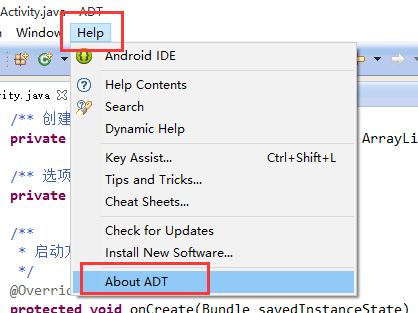
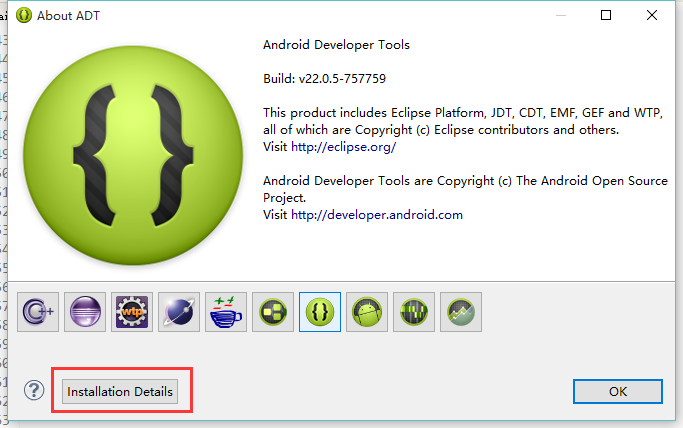
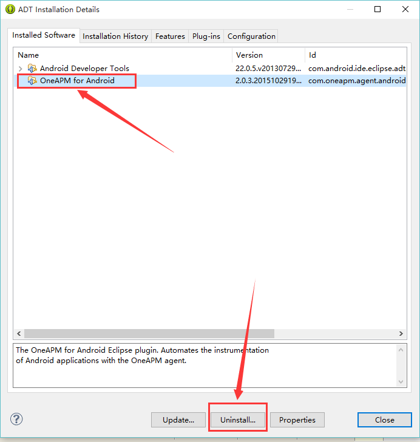
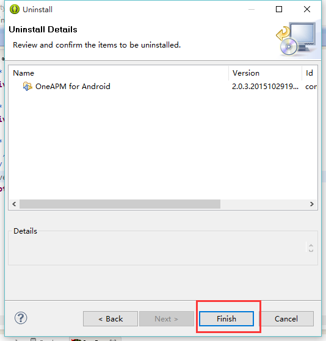

# Eclipse完全卸载说明

**注意**：Eclipse 安装 Android Agent 2.0.3.\* 版本升级到2.0.4.\*  需要先卸载旧探针再进行安装。

首先在 Eclipse 中卸载 OneAPM 的 Agent 插件： Help -> About ADT -> Installation Details。

打开Eclipse的安装目录：**\eclipse\plugins**

删除下面的目录：

