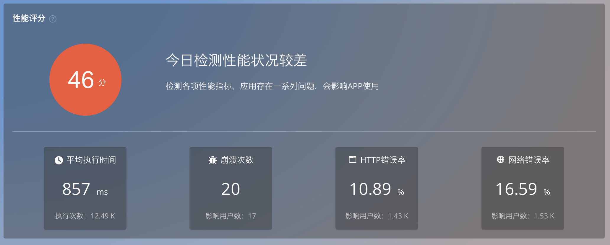
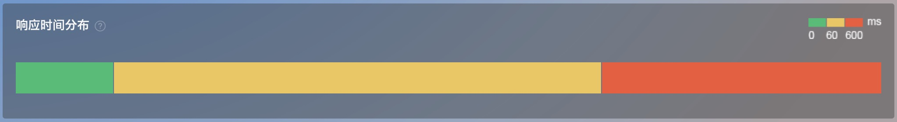
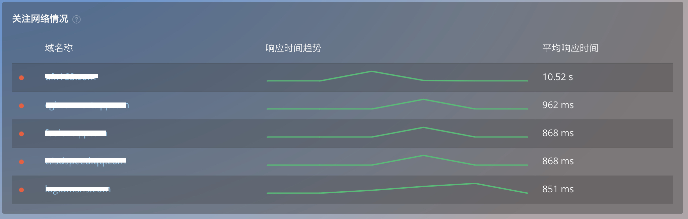
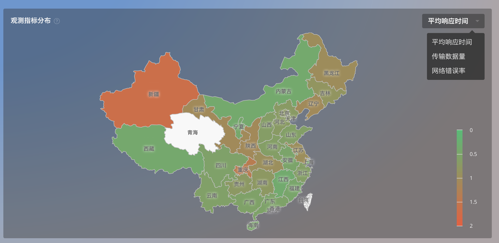
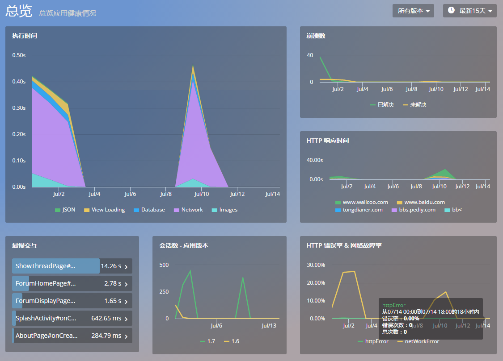

# 应用

关于移动应用的基本信息，Mobile Insight 主要提供以下信息：

##总览 

####该模块分新旧两版，新旧两版可自由切换。

**1.新版界面：**

  该版共分为5个模块
* 性能评分

  使用页面执行时间，崩溃率，网络错误率，HTTP错误率等各项核心性能指标给出APP整体性能评分。
  
  
  
 **评分指标：**

  IOS：平均执行时间（访问次数），崩溃次数（影响用户数），HTTP错误率 （影响用户数），网络故障率 （影响用户数）

  Android：平均执行时间（访问次数），崩溃次数（影响用户数），HTTP错误率 （影响用户数），网络故障率 （影响用户数）

 ** 性能评级:**

| 得分／次数 | 性能评级 | 标示 | 详情 |
| --| -- | -- | -- |
| （80-100） 分 | 本次检测性能状况良好 | 绿色 | 检测各项性能指标，未发现重要性能问题 |
| （60-80） 分 | 本次检测性能状况一般 | 黄色 | 检测各项性能指标，应用存在潜在风险，请持续关注APP性能 |
| < 60 分 | 本次检测性能状况较差 | 红色 | 检测各项性能指标，应用存在一些列问题，会影响APP使用 |
| 使用次数为0 |无性能状况信息 ，今日无用户使用应用  | —— | —— |
* 性能指标对比分析

   选择任意两个指标进行对比。
   
   对比指标：平均响应时间，传输数据量，网络错误率，日活，崩溃次数。
   
   

* 响应时间分布

   所选时间范围内，所有网络请求耗时进行阶段划分，默认按照订制区间[0-60ms)，[60-600ms),[600-Nms)划分网络性能状况。
   
   色块区间: 绿[0-60ms)，黄[60-600ms),红[600-Nms)
   
   
   
    
* 关注网络情况

   展示用户最关心的网络请求的趋势信息，默认展示平均响应时间TOP5的请求。
   
   

* 观测指标分布

   选择查看各性能指标地域分布情况。
   
   下拉选项：
   平均响应时间，传输数据量，网络错误率
   
   

**2.旧版界面**：

该模块主要展示以下六张图表：

- 执行时间：展示网络请求，数据库，UI 渲染，图片解析，JSON 解析的执行时间趋势图
-  崩溃数：按已解决与未解决划分的崩溃次数时间曲线。
- HTTP 响应时间：展示各类 HTTP 请求响应时间 TOP 5 的时间曲线。HTTP 响应时间是指从发送 HTTP 请求开始，到收到所有响应内容的时间。
- HTTP 错误率 & 网络故障率：以堆叠曲线图展示当前应用的各类 HTTP 错误率和网络故障率历史曲线。HTTP 错误率是指在选定时间段内，HTTP 错误数量与请求数量的比率。网络故障率是指网络错误数量与请求数量的比率。
其中发生网络错误的 HTTP 请求数指发生 DNS 解析错误、无法建连、连接超时等网络方面的错误数量。
- 会话数-应用版本：按版本展示会话数 TOP 5 的时间曲线。
- 最慢交互：展示交互耗时 TOP 5 的 Trace 列表。点击 Trace 名会跳转到该交互的详细页面。

*关键词：性能评分 总览 响应时间*

