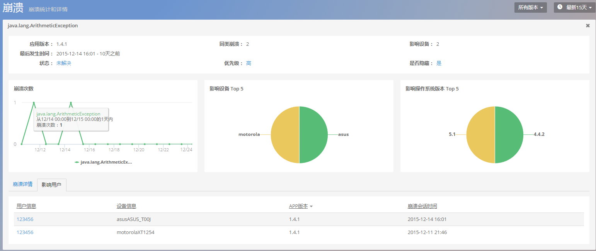
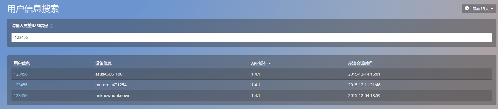

# 应用

关于移动应用的基本信息，Mobile Insight 主要提供以下信息：

[TOC]

##总览 

该模块主要展示以下六张图表：


- 执行时间：展示网络请求，数据库，UI 渲染，图片解析，JSON 解析的执行时间趋势图
-  崩溃数：按已解决与未解决划分的崩溃次数时间曲线。
- HTTP 响应时间：展示各类 HTTP 请求响应时间 TOP 5 的时间曲线。HTTP 响应时间是指从发送 HTTP 请求开始，到收到所有响应内容的时间。
- HTTP 错误率 & 网络故障率：以堆叠曲线图展示当前应用的各类 HTTP 错误率和网络故障率历史曲线。HTTP 错误率是指在选定时间段内，HTTP 错误数量与请求数量的比率。网络故障率是指网络错误数量与请求数量的比率。
其中发生网络错误的 HTTP 请求数指发生 DNS 解析错误、无法建连、连接超时等网络方面的错误数量。
- 会话数-应用版本：按版本展示会话数 TOP 5 的时间曲线。
- 最慢交互：展示交互耗时 TOP 5 的 Trace 列表。点击 Trace 名会跳转到该交互的详细页面。


##交互

交互功能用于监控终端用户与 App 交互时被调用代码的执行情况，用于分析发现耗时的用户交互。如图：


选择某个 Activity，查看该 Activity UI 主线程和 Worker 线程耗时状况。查看峰值，对执行次数最多，执行时间最长的线程进行优化。然后结合业务逻辑优化代码，尽量将耗时操作放在 worker 线程上，避免阻塞主线程进而影响用户体验。


点击慢交互列表中的任意交互名，可查看其详情：


##崩溃

崩溃界面按照崩溃解决与否、应用版本号实时展示崩溃数量变化图。崩溃列表则按照崩溃类型、代码信息、代码位置、首次发生时间、最后发生时间、应用版本号、发生次数、影响设备数以及崩溃状态展示崩溃的详细信息。

>崩溃次数统计图展示了 app 发生的崩溃数。它分为两部分:已解决和未解决。当 OneAPM mobile 发现了崩溃现象,将把该崩溃归类到未解决类别。当你解决一个 bug 时,你可以标记该 crash 为已解决状态。在图表中,所有出现该崩溃都会重新分配到已解决的类别中,重新规划崩溃次数图。随着你崩溃问题的修复,查看已解决崩溃次数图将降为 0。

>*注意:如果已解决崩溃数依旧在增长,那么就表明这个所谓的已解决崩溃并没有完全修复,或者用户没有更新 APP。*

>根据版本的崩溃次数统计图展示了随时间推移 app 发生的崩溃数的趋势。它是按照版本进行分类的。用于检验新发布版本较老版本的性能是否有显著提升。


**备注：OneAPM 采用 Version Code 为标识，监控应用版本信息，也即上文的应用版本号。**


可筛选查看未解决崩溃和被设置为优先级较高的一类崩溃信息。此外，点击代码位置，可跳转至该崩溃的详情页面。该页面以图形化的方式，展示了该崩溃的发生次数、影响的设备类型、操作系统类型，还包含了崩溃发生的特定环境、崩溃类型、崩溃轨迹，以及导致崩溃发生的线程，深入到代码行。


### 崩溃详情


* 统计某类崩溃在各类设备、操作系统和各 app 版本中出现的次数,被该崩溃影
响的用户数

* 交互追踪部分展示了所追踪的app，从用户会话开始到发生这一崩溃这段时间内的交互时间轴。这一部分可以帮助您重现用户操作,还原本次崩溃异常现场。

* 堆栈信息部分记录崩溃时的崩溃 log 和线程堆栈详情信息


### 影响用户




展示该类崩溃影响的具体用户的详细信息，点击用户信息，查看该用户使用APP的详细信息。


##用户信息


- 通过搜索关联用户信息，得到该用户使用APP时设备的崩溃次数，以及崩溃详情。
- 查看某类崩溃影响的用户信息列表。

*注意：用户信息模块崩溃查询功能以及崩溃模块影响用户列表只在付费后可使用或查看。*

该模块提供查询单个用户发生的崩溃信息的入口。


此外，通过设置用户识别信息，您可以自定义收集用户信息。
我们提供的接口如下：

* IOS 配置用户信息


```+ (void)setCustomInfo:(NSString *)info;```

*备注：setCustomInfo 内容长度为200字节，即100个汉字长度，超过部分会被截取。*

用法示例：

>```[OneAPM setCustomInfo:@"18611421164"];```

>```[OneAPM startWithApplicationToken:@"225D3C244ACE5E49F1CFA920EF94D8A489"];```

* Android 配置用户信息


 ``` ContextConfig contextConfig = new ContextConfig();```
 
 ``` contextConfig.setSearchField("user_imsi_custom");```
 
 
*参数配置：*


HashMap<String,String> extraData = new HashMap<String, String>();

extraData.put("手机号码","");
 
extraData.put("用户ID","");
 
extraData.put("邮箱","88888@qq.com");
 
contextConfig.setExtra(extraData);


### 按照上传信息查询用户崩溃情况


如图，在输入框中键入用户信息，可以查询单个用户发生崩溃的信息。



查询结果包括：用户信息，用户使用的设备信息，APP版本以及崩溃开始时间。


### 查看崩溃详情

点击单条信息，可查看发生崩溃时用户所处的环境：


点击崩溃列表中的崩溃名，可跳转至崩溃详情页：


