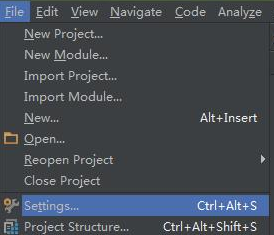
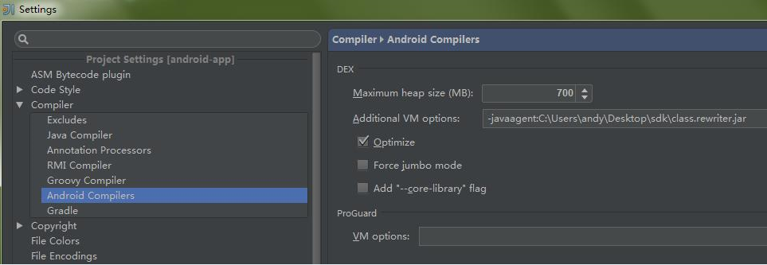

# IntelliJ IDEA eclipse 项目安装方法

本文主要介绍在 IntelliJ IDEA eclipse 环境下安装 OneAPM Android SDK 的步骤：

## 1、下载 Anroid Agent SDK

在移动应用 > 添加应用 > Android 页面，根据 Ant 方法下载 OneAPM Android Agent SDK，解压到某处。如下图：


## 2、设置 Android 编译的代理路径

* 选择 file->settings



* 找到 Android Compilers，设置 Additional VM 参数



**注意**：Additional VM 参数值的设置为： -javaagent: 你的 class.rewriter.jar 文件所在的绝对路径。

此处的值为 -javaagent: C:\Users\andy\Desktop\sdk\class.rewriter.jar。

其中 C:\Users\andy\Desktop\sdk\class.rewriter.jar 是我本地的路径。

## 3、拷贝 oneapm-android-agent.jar 文件到工程的 libs 目录

添加 libs 目录下的 oneapm-android-agent.jar 到你的 build path 中。

## 4、添加 OneAPM 启动代码

在你启动页面，一般是 onCreate 的方法中添加 OneAPM 启动代码。

启动代码示例：

```java
BlueWare.withApplicationToken("use app token created at step 1")
.start(this.getApplication());
```

注册 OneAPM 账户，选择移动应用，点击添加应用程序即可获得 App token 。

其余流程和 Ant 安装流程一样，请自行对照并查看配置等是否遗漏。

## 5、重建项目，静候数据

执行 Build-->Rebuild Project 重建项目，如果一切顺利，大约2、3分钟的操作之后即可在后台看见数据了。