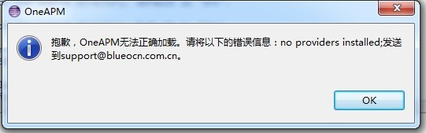

# SDK 安装后提示错误信息：No providers installed

## 故障说明

Android SDK 通过 Eclipse 插件方法安装完成，重启后出现 No providers installed 异常

## 解决方案

**原因一**：没有使用 sun JDK，请安装 sun 官方 JDK 。

**原因二**：若安装了其他第三方性能监控的 Eclipse 插件，请卸载其他第三方性能监控插件或者重新解压一份新的 Eclipse 重新安装 OneAPM 插件。

**原因三**：使用了 sun JDK ，并且 `JAVA_HOME` 指向了这个 JDK ，但是 `path` 下的 "java" 命令不是这个 JDK 里面的 Java ，而是操作系统给你默认安装的 JRE 下的，如:

`c:\Program Files\java\....`

请配置 Java 命令指向 JDK 下面的 Java。

**原因四**：电脑安装了不同版本的 JDK ，但是把这些 JDK 都配置到了环境变量中。请去除多余的 Java 环境变量，在环境变量中配置一个 Java 版本即可。