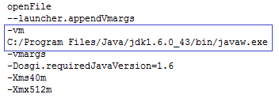

# SDK 安装后提示错误信息：由于使用 JRE 运行 Eclipse 导致 OneAPM 无法正确加载

## 故障说明

Android SDK 通过 Eclipse 插件方法安装完成，重启后出现 OneAPM 启动异常


## 解决方案

* 第一步：检查 JAVA_HOME 是否设置，如果设置了，将 JAVA_HOME 设置在 PATH 环境变量的第一位；

* 第二步：找到 Eclipse 目录下的 eclipse.ini；

* 第三步：添加 vm 参数，将 -vm 添加到 openFile 参数之后；

```
-vm
<path>/bin/javaw.exe
```

**注意**： 需要修改，设置成用户个人的 JDK 的路径，注意换行！

添加完之后 eclipse.ini 文件内容相对结构如下



* 第四步：重启 Eclipse。