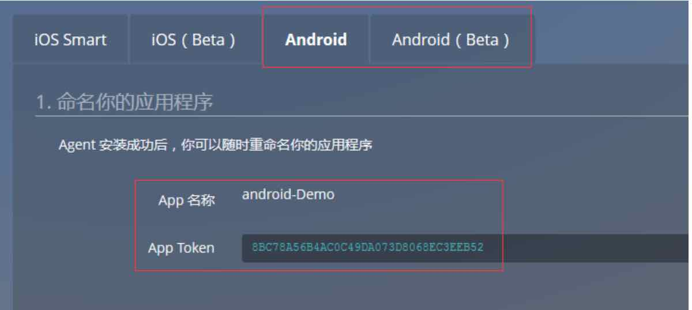

# SDK 成功部署后 OneAPM 界面无数据显示

**问题一**：在 App 上没有发生用户操作。

OneAPM 监控的是真实用户体验，只有在用户进行交互操作才会有性能数据产生。

**问题二**：性能数据正在上传中。

App 每隔一分钟发送一次数据给 OneAPM。首次触发 App，性能数据不会立即上传到 OneAPM 。请在交互操作之后，至少等待 1 分钟。

**问题三**：没有打开网络或网络不通。

在没有网络的问题下，性能数据无法上传到 OneAPM 平台。

**问题四**：不同的 App，使用同一个 `App Token` 。

每个 App 的 ApplicationId，对应唯一的 `Token`。首个使用 `Token` 的 App 被认为是合法用户，之后使用同一 `Token` 的 App 被视为非法请求，性能数据将被过滤。

**问题五**：某些编译器没有对已缓存的代码进行二次编译。

由于某些编译器，例如 Eclipse 在有些情况下，会缓存一些代码，为了提高代码编译的效率，对于一些已经缓存的代码，编译器不会做二次编译。所以为了确保成功集成 OneAPM ，需要对于编译器生成的一些缓存文件例如 Eclipse 的 Android 工程下面的 bin 、gen 文件夹等要执行手动删除操作，之后回到工作空间手动 clean ，再次导出包安装运行，查看后台是否有数据。
