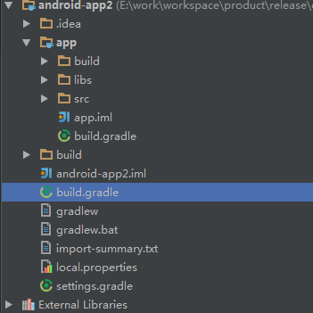

# OneAPM for Android

OneAPM Android SDK 会在用户 Java 代码编译期间检测用户用了哪些可能影响用户的 App 性能的接口，并在这些接口执行前记录接口执行的开始时间，在执行后，记录接口的结束时间。

这两个时间的差值就是接口的执行时间，加上其他一些可能的参数一起上报给 Server。Server 根据这些收集到的数据分类的可视化展示，就是你们看见的数据了。

我们的 Agent 启动之后会自己启动一个自己的线程，等于说 SDK 试运行在和用户 App 隔离开的一个沙盒中。可能影响用户 App 性能的安卓系统接口，例如数据库操作中的 insert、update 等；JSON 解析中的 parse 等方法，页面加载中的 onCreate 等方法，图片加载中的 bitmapFactory 中的 decodeFile 方法。希望这个简单的说法能说明白，不明白的或者不到位的请联系 OneAPM 的技术支持。

需要说明的是目前 OneAPM Eclipse 插件是不支持 JDK 1.8 的，使用 JDK 1.8 的用户可以通过下载安装 OneAPM SDK 来监控管理 App。

# SDK 安装说明

## Android SDK - Gradle 插件安装方法

1. 命名应用程序并获取 App token

    第一步：命名应用程序。

    第二步：复制 App token 的序列码，在接下来的步骤中使用。
    
2. 下载并解压 OneAPM SDK

3. 配置 Gradle

    第一步：打开工程根目录下的 build.gradle 文件。

    

    第二步：在 dependencies 模块中加入代码。
    

