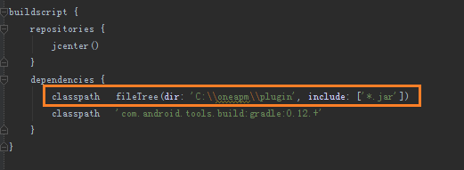
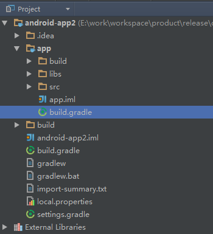
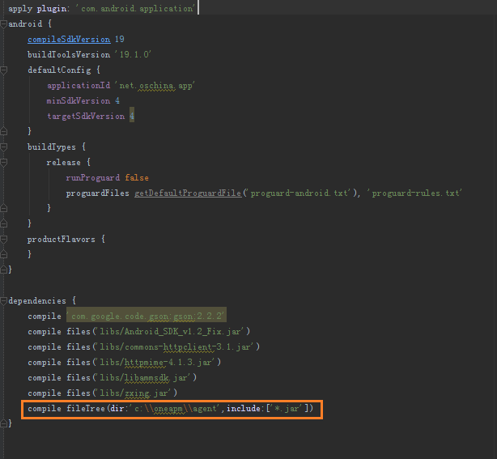
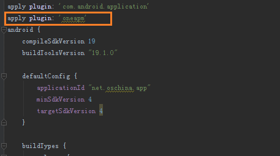

# OneAPM for Android

## SDK 安装说明

OneAPM Android SDK 会在用户 Java 代码编译期间检测用户用了哪些可能影响用户的 App 性能的接口，并在这些接口执行前记录接口执行的开始时间，在执行后，记录接口的结束时间。

这两个时间的差值就是接口的执行时间，加上其他一些可能的参数一起上报给 Server。Server 根据这些收集到的数据分类的可视化展示，就是你们看见的数据了。

我们的 Agent 启动之后会自己启动一个自己的线程，等于说 SDK 试运行在和用户 App 隔离开的一个沙盒中。可能影响用户 App 性能的安卓系统接口，例如数据库操作中的 insert、update 等；JSON 解析中的 parse 等方法，页面加载中的 onCreate 等方法，图片加载中的 bitmapFactory 中的 decodeFile 方法。希望这个简单的说法能说明白，不明白的或者不到位的请联系 OneAPM 的技术支持。

需要说明的是目前 OneAPM Eclipse 插件是不支持 JDK 1.8 的，使用 JDK 1.8 的用户可以通过下载安装 OneAPM SDK 来监控管理 App。


## Android SDK - Gradle 插件安装方法

1. 命名应用程序并获取 App token

    第一步：命名应用程序。

    第二步：复制 App token 的序列码，在接下来的步骤中使用。
    
1. 
下载并解压 OneAPM SDK

1. 
配置 Gradle

第一步：打开工程根目录下的 build.gradle 文件。


第二步：在 dependencies 模块中加入代码。

```classpath fileTree(dir: 'YourOneAPMPath/oneapm/plugin', include: ['*.jar'])```



4.引入 OneAPM

第一步：打开主模块目录下的 build.gradle 文件。



第二步：在 dependencies 模块中加入代码。

```compile fileTree(dir:'YourOneAPMPath/oneapm/agent',include:['*.jar'])```



第三步：在文件头部引入 OneAPM。

```apply plugin: 'oneapm'```



5.rebuild & clean 项目

建议 rebuild & clean 项目，来确保 OneAPM 配置生效。

6.配置授权信息

确保应用程序的 AndroidManifest.xml 配置文件中，引入了 INTERNET 和 ACCESS_NETWORK_STATE 两个请求授权：

```<uses-permission android:name="android.permission.INTERNET" />```

```<uses-permission android:name="android.permission.ACCESS_NETWORK_STATE" />```

若想使用 Crash 快照功能，请引入以下授权信息：

```<uses-permission android:name="android.permission.GET_TASKS" />```

注意：如果您的应用使用 progurd 混淆，请配置以下：

```
-dontwarn org.apache.commons.**
 -keep class org.apache.http.impl.client.**
 -dontwarn org.apache.commons.**
 -keep class com.blueware.** { *; }
 -dontwarn com.blueware.**
 -keepattributes Exceptions, Signature, InnerClasses
```

7.启动 Agent

在默认 Activity 中 import BlueWare 类：

```import com.blueware.agent.android.BlueWare;```

在 onCreate() 方法中加入如下 call 来初始化 oneAPM（其中包含了在步骤 2 中根据应用程序名称而生成的授权编号）：

```BlueWare.withApplicationToken("<generate app token by creating a name above>").start(this.getApplication());```

8.启动应用程序

clean project，并重新在模拟器或设备中启动应用程序，开始应用性能管理。

9.静候 5 分钟，开启 OneAPM 之旅

静候 5 分钟，等待应用程序向 OneAPM 发送应用程序性能数据，即可开始使用 OneAPM 应用性能管理。

若应用程序无数据展现，或安装过程中有任何问题:

您可以采取以下方式解决问题：

* 
技术支持热线：400-622-3101

* 
OneAPM 客服邮箱：support@oneapm.com


