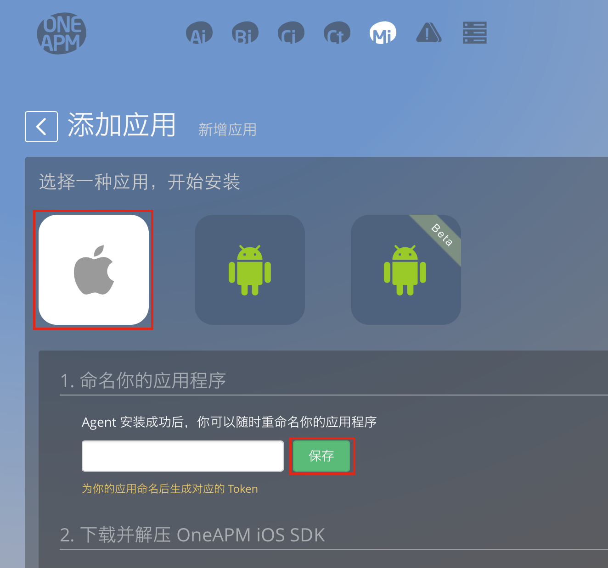
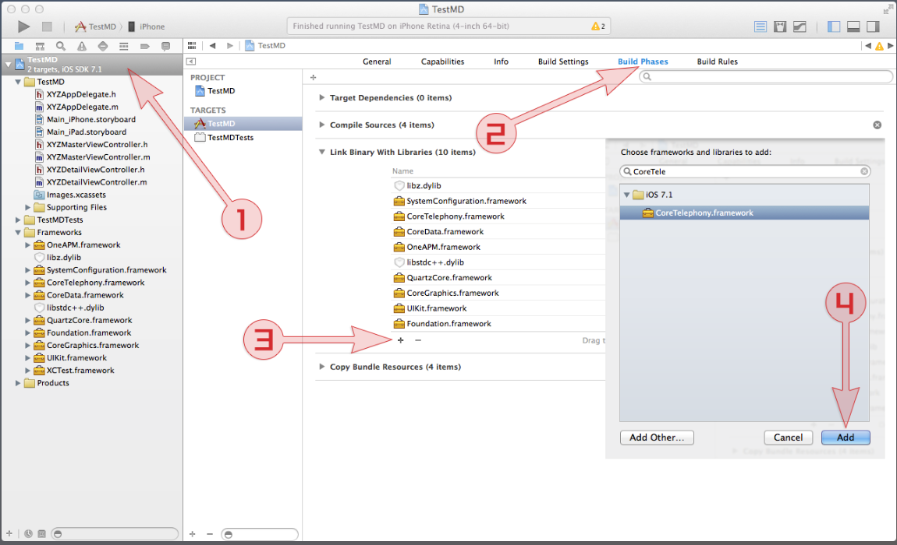

# ios SDK 安装步骤

一. 命名你的应用程序
进入https://mi.oneapm.com/mobile/app/setup#/
点击苹果图标，查看安装步骤，为您的应用取名。


点击“保存”
为您的应用命名后生成对应的 Token

二. 下载并解压 [OneAPM iOS SDK （关闭 bitcode）](https://download.oneapm.com/ios_agent/iOS_SDK_latest_Xcode6.zip)，[OneAPM iOS SDK （开启 bitcode）](https://download.oneapm.com/ios_agent/iOS_SDK_latest_Xcode7.zip)


三. 添加 OneAPM Framework 至 Xcode 项目中
解压 SDK，并将「OneAPM.framework」文件夹从 Finder 中拖拽至 Xcode 项目中（悬停至导航窗口的项目中）。出现提示窗口时，选择「Copy items into destination...」和「Create folder references...」。

四. 在 Linker Settings 中添加以下 5 个 Libraries
在项目导航窗口内点击你的 Project，并选中你的 App，然后选择「Build Phases」选项卡。打开「Link Binary with Libraries」列表。点击添加：
```
SystemConfiguration.framework
CoreTelephony.framework
CoreData.framework
libz.dylib（Xcode6及以前版本）／libz.tbd(Xcode7)
libstdc++.dylib（Xcode6及以前版本）／libstdc++.tbd(Xcode7)
```
](one1.png)
五. 启动 Agent
在项目文件 [app_name]-Prefix.pch（通常在文件夹「Support Files」中）中，引入 OneAPM 头文件：
```
import <OneAPM/OneAPM.h>
```
在文件 main.m 中添加如下代码：
```
int main(int argc, char * argv[]) {
@autoreleasepool {
[OneAPM startWithApplicationToken:@"<use app token created at step 1>"];
return UIApplicationMain(argc, argv, nil, NSStringFromClass([AppDelegate class]));
}
}
```
六. 运行应用程序
Clean Project，并重新在模拟器或设备中启动应用程序，开始应用性能管理。

(注：开发时若要试用“崩溃统计”功能，请选Release模式在真机上运行)

七. 重启
请静候 1 分钟，等待应用程序向 OneAPM 发送应用程序性能数据，即可开始使用 OneAPM 应用性能管理。

八. 符号化表（dSYM文件）上传
当应用列表可以显示出应用“包名”等信息后：

1. 点击“崩溃”进入崩溃信息展示界面;
2. 点击崩溃信息界面右上角“上传dSYM文件”按钮，选择APP版本号，选择要上传的dSYM文件"选取"，“保存”。

