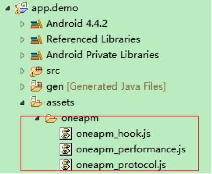
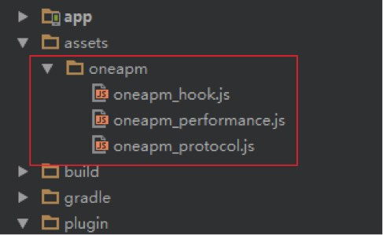

# WebView 性能监控使用说明

当您按照 OneAPM Android SDK 安装方法完成安装后，只需执行以下两步就可以使用 WebView 监控功能。

WebView 监控 JavaScript 文件下载链接:https://oneapm.kf5.com/posts/view/45662/

* 1、eclipse安装方式：

拷贝包含 oneapm_hook.js、oneapm_performance.js、oneapm_protocol.js 文件的 oneapm 文件夹到 Android 项目工程的 assets 文件夹下，如果没有这个文件夹请手动添加。添加完成之后，项目结构如下图所示：


* 2、Android Studio安装方式：

拷贝包含 oneapm_hook.js、oneapm_performance.js、oneapm_protocol.js 文件的 oneapm 文件夹到 app/src/main 下的 assets 文件夹下，如果没有这个文件夹请手动添加。添加完成之后，项目结构如下图所示：



* 3、在自己的代码中找到需要监控的 WebView 对象，新建一个OneapmWebViewClient 对象，代码如下。其中onPageFinished和shouldOverrideUrlLoading这两个代码必须要调用super方法。

说明：如果您自己有WebViewClient这个类，请保证这个类继承自OneapmWebViewClient 这个类，并调用相关的父类super方法。

代码示例：

```
OneapmWebViewClient client = new OneapmWebViewClient(webView){

@Override
public void onPageFinished(WebView view, String url) {

super.onPageFinished(view, url);

}

@Override
public boolean shouldOverrideUrlLoading(WebView view, String url) {

return super.shouldOverrideUrlLoading(view, url);

}
};
```

自定义WebViewClient示例代码：

```
public class MyWebViewClient extends OneapmWebViewClient{

public MyWebViewClient(WebView wView) {
// TODO Auto-generated constructor stub
super(wView);
}

@Override
public void onPageFinished(WebView view, String url) {

super.onPageFinished(view, url);

}

@Override
public boolean shouldOverrideUrlLoading(WebView view, String url) {

return super.shouldOverrideUrlLoading(view, url);

}
} 
```

调用webview的setWebViewClient把步骤1的对象设置进去。


```
webView.setWebViewClient(client);

```

* 
4.测试，集成结束后，正常运行您的应用程序，打开包含 WebView 的页面，一段时间后就可登录 OneAPM 点击 WebView 查看是否出现 WebView 的性能数据。

**注意**：WebView监控功能 Android 4.3 及以上版本可用。
