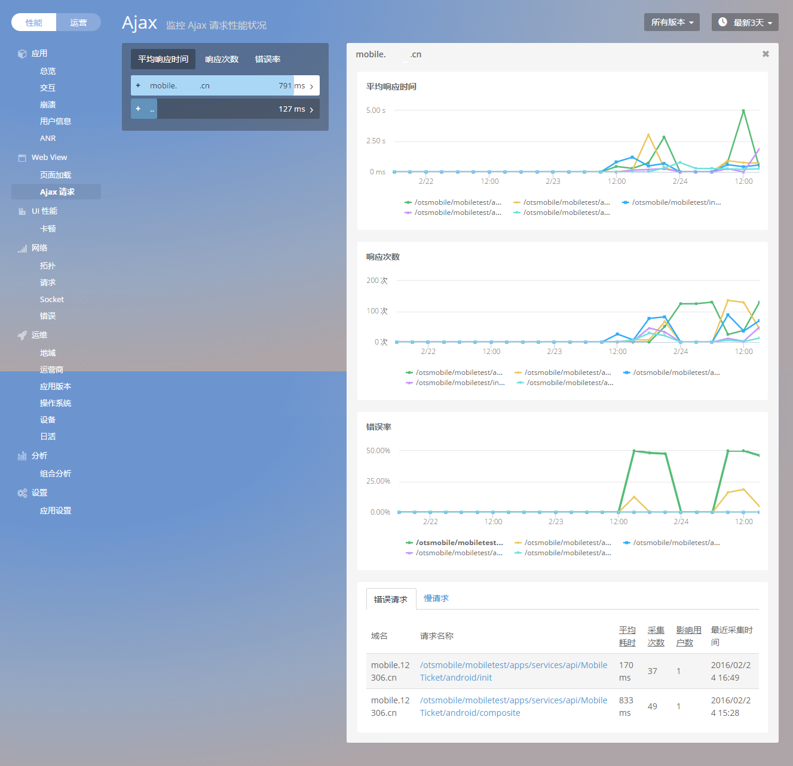
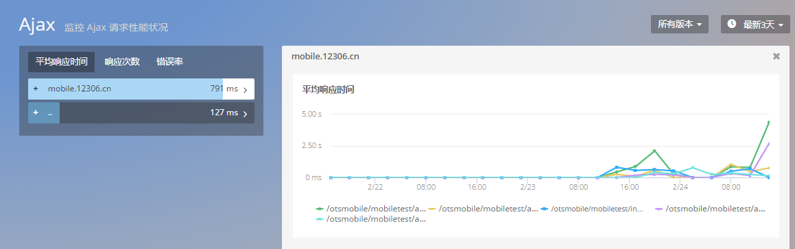
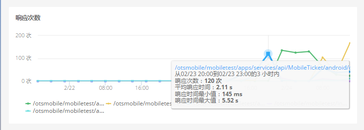
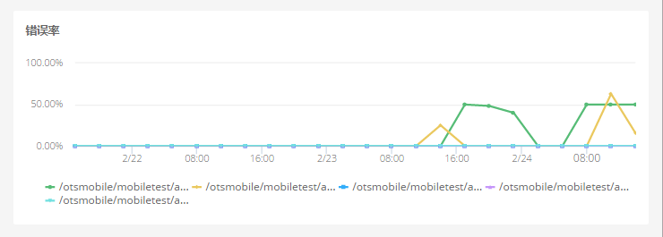
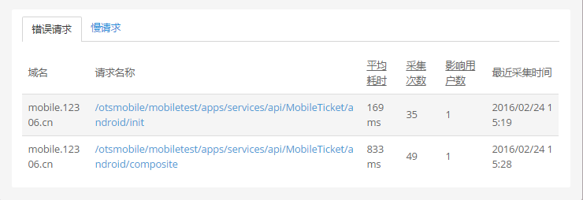
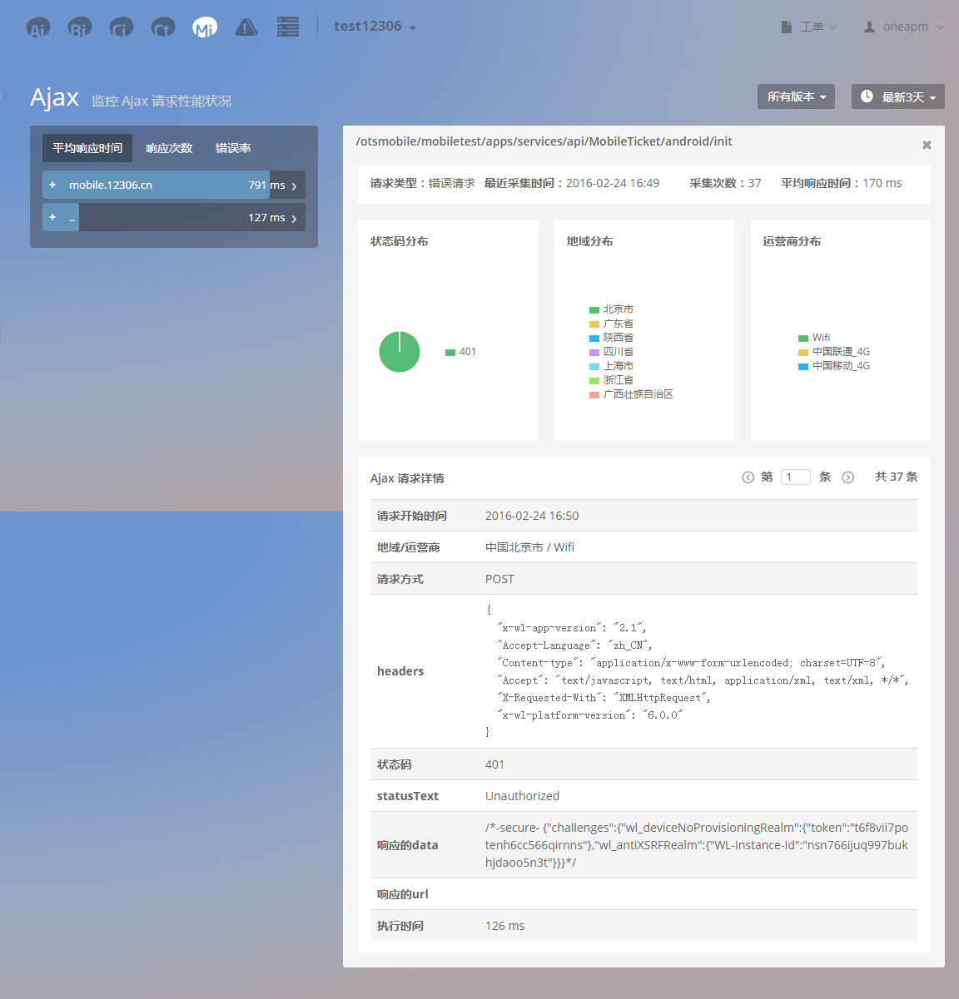
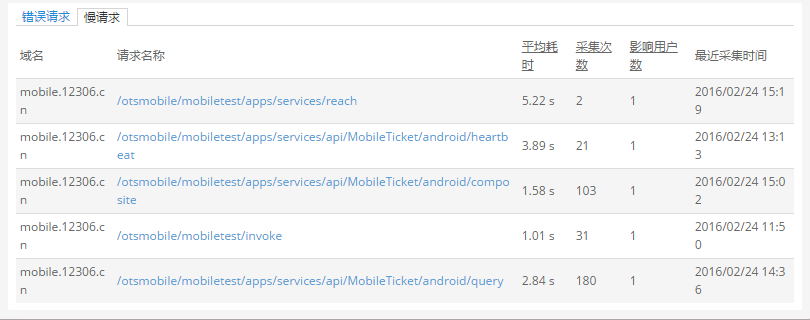
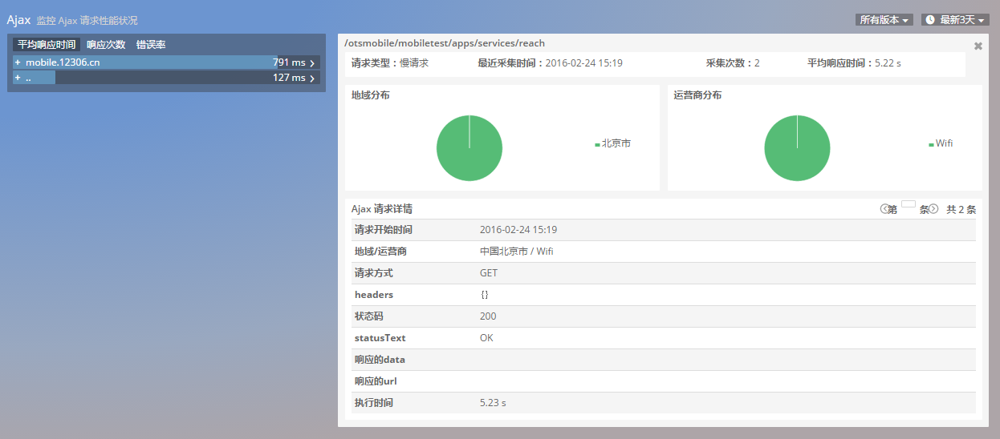

# Ajax请求
Webview->Ajax请求页

WebView 中Ajax请求，展现了Ajax请求的平均响应时间，响应次数，错误率的趋势图以及错误请求和慢请求追踪列表

## 1 平均响应时间趋势信息图

平均响应时间趋势信息图展示响应时间TOP5请求（域名）的趋势信息的堆叠趋势图，便于查看APP总体平均响应时间趋势状况。鼠标悬停在请求曲线上则显示当前时间AJAX请求的详细信息

左侧列表选择单个域名：右侧图表展示该域名下TOP5请求平均响应时间趋势曲线对比图

左侧列表选择单个请求：右侧图表展示该请求平均响应时间的趋势曲线对比图

## 2 响应次数趋势信息图
响应次数趋势信息图展示响应次数TOP5请求（域名）的趋势信息的堆叠趋势图，便于查看APP总体响应次数趋势状况。鼠标悬停在请求曲线上则显示当前时间AJAX请求的详细信息

左侧列表选择单个域名：右侧图表展示该域名下TOP5请求响应次数趋势曲线对比图

左侧列表选择单个请求：右侧图表展示该请求的响应次数趋势曲线对比图

## 3错误率趋势信息图

错误率趋势信息图展示错误率TOP5请求（域名）的错误率对比趋势信息图，鼠标悬停在请求曲线上则显示当前时间AJAX请求错误的详细信息。

左侧列表选择单个域名：右侧图表展示该域名下TOP5请求错误率趋势曲线对比图

左侧列表选择单个请求：右侧图表展示该请求的错误率趋势曲线对比图

Ajax请求 总错误率 = （所有Ajax请求）总错误次数/总请求次数；域名错误率=（该域名下的所有请求） 发生错误总次数/总请求次数；单条请求错误率=（该请求） 发生错误总次数/总请求次数

## 4 Ajax 请求信息列表
Ajax请求信息列表分为错误请求列表与慢请求列表，默认展示：错误请求信息

错误请求列表内展示：域名，请求名称，平均耗时，采集次数，影响用户数，最近采集时间

点击Ajax错误请求信息列表中任意一条，进入Trace详情页：

其中状态码分布、地域分布、地域分布分别展示TOP10 分布占比（TOP9+其它类型）

慢请求信息采集条件：Ajax请求耗时>0.65s ，可在设置页面修改阈值。

点击Ajax慢请求信息列表中任意一条，进入Trace详情页：

 

