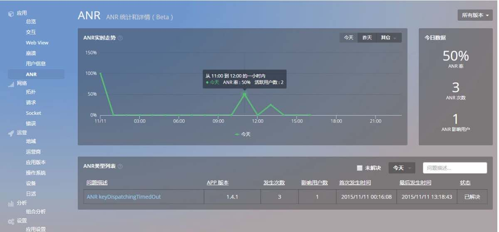
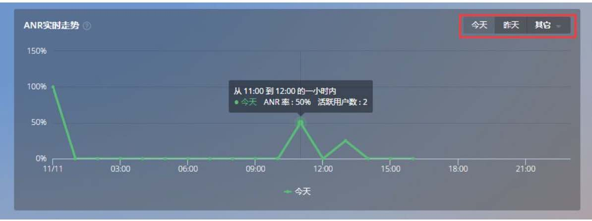
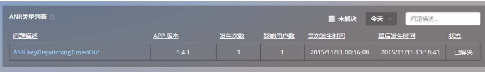
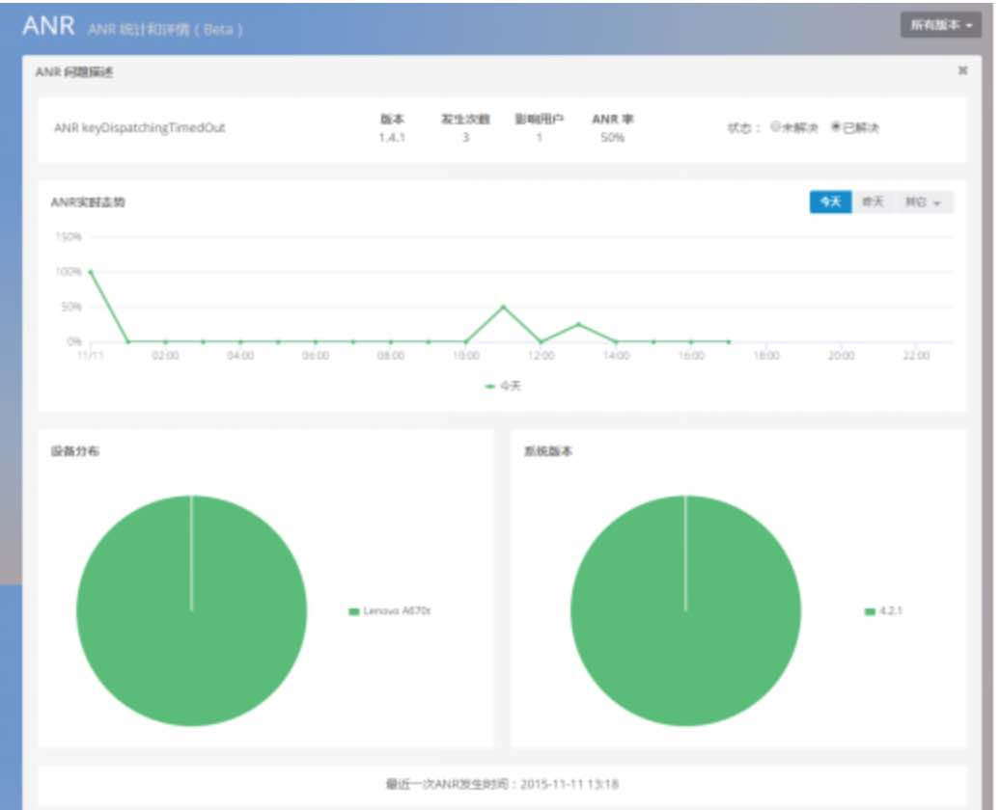
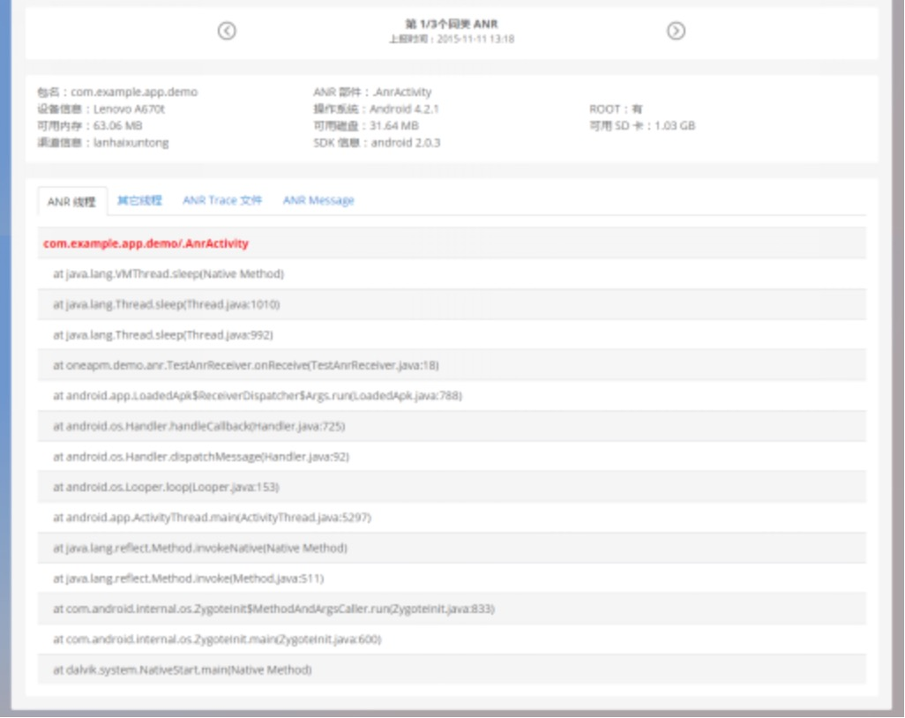

# ANR

ANR，全称 Application Not Responding 或 The Application of Non Response，意思是“应用无响应”。本文主要介绍 ANR 产生原因以及 OneAPM Moblie Insight 提供的 ANR 数据抓取及展示功能。

引起 ANR 问题的根本原因，可以大致归为两类：

* 应用进程自身引起

>例如：主线程阻塞、挂起、死循环。应用进程的其他线程 CPU 占用率过高，导致主线程无法抢占 CPU 时间片等。

* 其他进程间接引起

> 例如：当前应用进程与其他进程开展通信请求，其他进程长时间没有反馈。或者其他进程 CPU 占用率过高，导致当前应用进程无法抢占 CPU 时间片。

*ANR 对于应用的影响并不亚于 Crash。那我们如何监控 ANR 呢？*

OneAPM Mobile Insight 提供了 ANR 监控功能：

ANR 统计包括：ANR 趋势信息以及 ANR 率。默认情况下展示 ANR 当天趋势信息，若鼠标悬停，则展示此时 ANR 率。

**ANR 率 = ANR 影响用户/活跃用户数。**

ANR 类型列表：按 APP 版本与 ANR 类型进行分类展示 ANR 问题，展示某类 ANR 所影响的用户数，以此表征问题严重程度。

点击列表中问题描述，查看 ANR 信息详情：

查看某版本上该类 ANR 问题分布设备与操作系统版本的比例，以及 ANR 发生趋势，帮助您从宏观上控制 ANR 影响范围。

ANR 线程等信息记录，帮助用户定位造成 ANR 的原因。

关键词：*ANR 应用无响应 线程阻塞*
