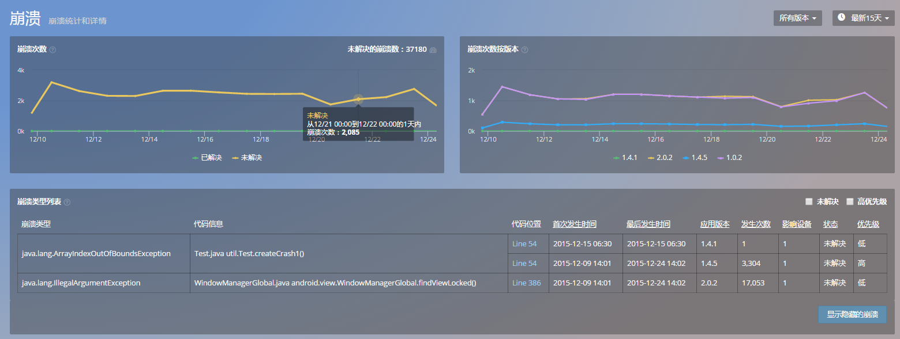
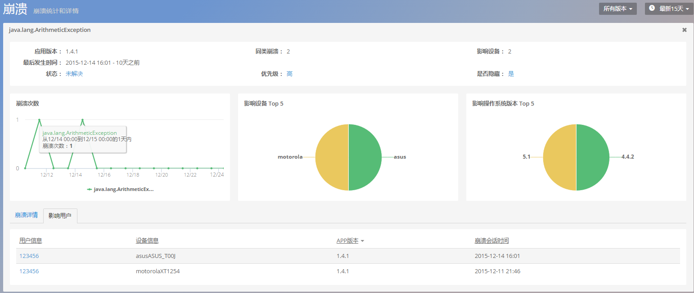
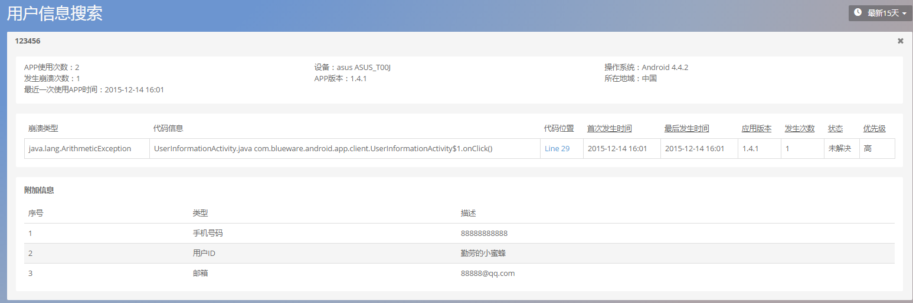

# 崩溃

崩溃界面按照崩溃解决与否、应用版本号实时展示崩溃数量变化图。崩溃列表则按照崩溃类型、代码信息、代码位置、首次发生时间、最后发生时间、应用版本号、发生次数、影响设备数以及崩溃状态展示崩溃的详细信息。

>崩溃次数统计图展示了 app 发生的崩溃数。它分为两部分:已解决和未解决。当 OneAPM mobile 发现了崩溃现象,将把该崩溃归类到未解决类别。当你解决一个 bug 时,你可以标记该 crash 为已解决状态。在图表中,所有出现该崩溃都会重新分配到已解决的类别中,重新规划崩溃次数图。随着你崩溃问题的修复,查看已解决崩溃次数图将降为 0。

>*注意 : 如果已解决崩溃数依旧在增长,那么就表明这个所谓的已解决崩溃并没有完全修复,或者用户没有更新 APP。*

>根据版本的崩溃次数统计图展示了随时间推移 app 发生的崩溃数的趋势。它是按照版本进行分类的。用于检验新发布版本较老版本的性能是否有显著提升。

**备注：OneAPM 采用 Version Code 为标识，监控应用版本信息，也即上文的应用版本号。**

可筛选查看未解决崩溃和被设置为优先级较高的一类崩溃信息。此外，点击代码位置，可跳转至该崩溃的详情页面。该页面以图形化的方式，展示了该崩溃的发生次数、影响的设备类型、操作系统类型，还包含了崩溃发生的特定环境、崩溃类型、崩溃轨迹，以及导致崩溃发生的线程，深入到代码行。

### 崩溃详情

* 统计某类崩溃在各类设备、操作系统和各 app 版本中出现的次数,被该崩溃影
响的用户数

* 交互追踪部分展示了所追踪的app，从用户会话开始到发生这一崩溃这段时间内的交互时间轴。这一部分可以帮助您重现用户操作,还原本次崩溃异常现场。

* 堆栈信息部分记录崩溃时的崩溃 log 和线程堆栈详情信息

### 影响用户

展示该类崩溃影响的具体用户的详细信息，点击用户信息，查看该用户使用APP的详细信息。

关键词：*崩溃 追踪 影响用户 代码行*
