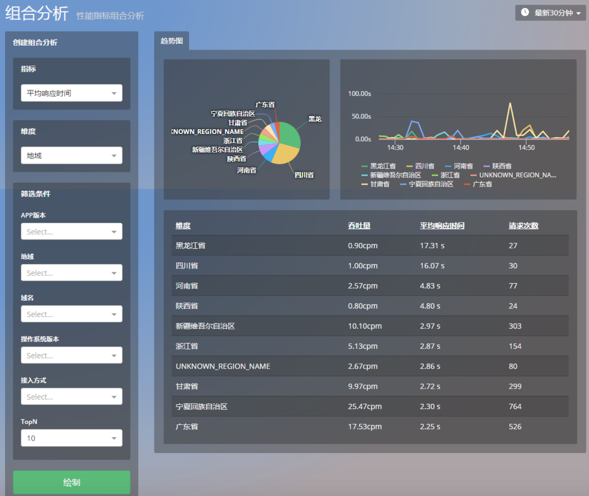
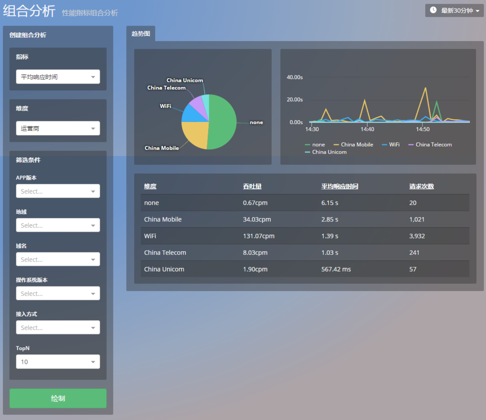
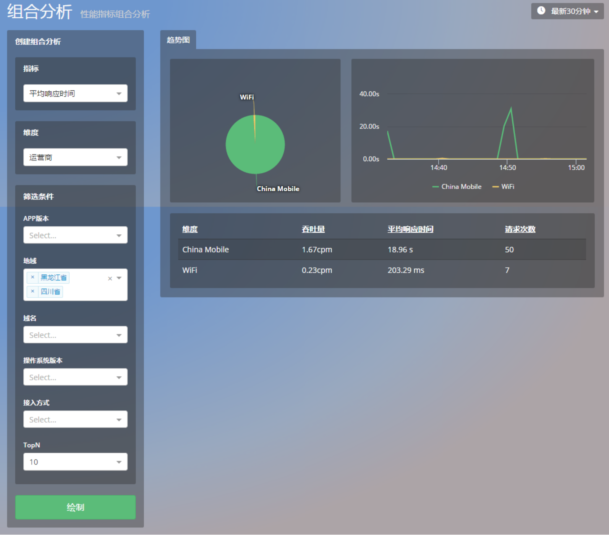

# 分析

> Mobile Insight 的分析模块主要提供组合分析功能。可灵活设置各种指标和维度并可进行任意筛选，生成统计视图，帮助用户从多个角度和方位定位性能问题。

分类：

* 崩溃组合分析
* 网络组合分析

## 崩溃组合分析
如下表所示，崩溃的组合分析以崩溃次数为首要指标，支持从多个维度进行对比分析，亦可以按照多个条件对信息进行筛选，达到更高的细粒度。

| 指标      | 维度      | 筛选条件     |
| -- | -- | -- |
| 崩溃次数 | App 版本，设备型号，操作系统版本，崩溃类型 | App 版本，操作系统版本，崩溃类型，用户信息  |

## 网络的组合分析

如下表所示，网络的组合分析包括HTTP错误数，HTTP错误率，网络错误数，网络错误率，响应时间，流量，吞吐量七个方面，每个方面都支持从多个维度进行对比分析，再按照指定的筛选条件对选定的维度进行更细致的筛选。
注意，维度仅支持单选，筛选条件可以多选。

| 指标 | 维度 | 筛选条件 |
| -- | -- | -- |
| HTTP 错误数 | App 版本，地域，域名，操作系统版本，设备厂商，运营商，接入方式，状态码 | App 版本，地域，状态码，域名，操作系统版本，运营商，接入方式 |
| HTTP 错误率 | App 版本，地域，域名，操作系统版本，设备厂商，运营商，接入方式，状态码 | App 版本，地域，状态码，域名，操作系统版本，运营商，接入方式 |
| 网络错误数 | App 版本，地域，域名，操作系统版本，设备厂商，运营商，接入方式，故障类型 | App 版本，地域，故障类型，域名，操作系统版本，运营商，接入方式 |
| 网络错误率 | App 版本，地域，域名，操作系统版本，设备厂商，运营商，接入方式，故障类型 | App 版本，地域，故障类型，域名，操作系统版本，运营商，接入方式 |
| 响应时间 | App 版本，地域，域名，操作系统版本，设备厂商，运营商，接入方式 | App 版本，地域，域名，操作系统版本，运营商，接入方式 |
| 流量 | APP版本，地域，域名，操作系统版本，设备厂商，运营商，接入方式 | App 版本，地域，域名，操作系统版本，运营商，接入方式 |
| 吞吐量 | App 版本，地域，域名，操作系统版本，设备厂商，运营商，接入方式 | App 版本，地域，域名，操作系统版本，运营商，接入方式 |

## 如何诊断运营商在不同地域的网络性能

在以往，我们使用移动应用的「地域」功能，仅仅只可以查看各个地域的 HTTP 响应时间及排名。如果使用「运营商」功能，还可以查看各个运营商的 HTTP 响应时间以及排名。不过，此前这两个功能是各自独立的，并无什么关联，所以提供的信息过于粗放，不利于分析问题。
如果想了解各个运营商在不同地域的网络性能，可以使用「组合分析」功能。
首先，在组合分析页面，选择您关心的网络性能指标，譬如平均响应时间，维度选定为地域，点击绘制，就会出现下图：

通过视图我们可以非常直观的发现，来自黑龙江省和四川省的网络请求平均耗时最长。
接下来，您可以将维度改选为运营商，点击绘制，就会出现下图：

该图展示了各个运营商的网络性能。接下来，在筛选条件栏目下，我们点击地域，选择网络性能最差的两个地区：黑龙江省和四川省，点击绘制，出现下图：

显而易见，应用在黑蜀两地的响应时间如此之慢，运营商 China Mobile 有着重大的责任。您也可以举一反三，排列组合我们提供的分析维度和筛选条件，更加细致地了解应用在不同条件下的网络性能。

关键词：分析  组合分析  崩溃分析  网络分析

