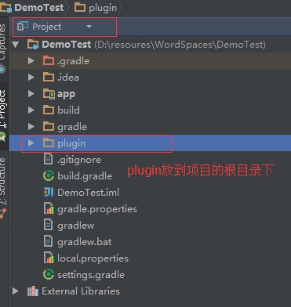
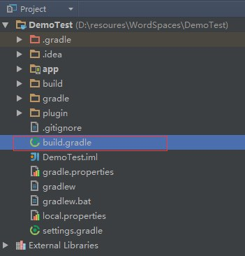
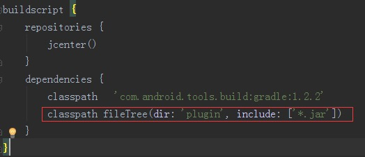
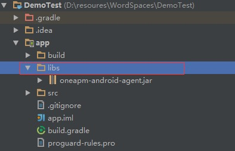
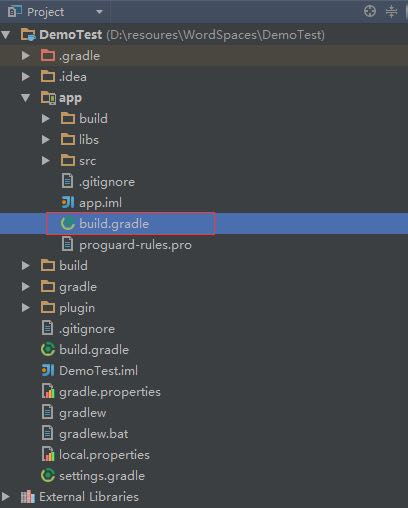
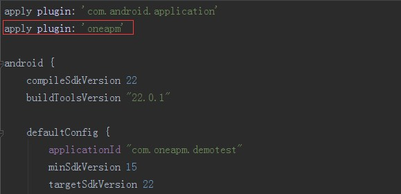

# Android SDK - Gradle 插件安装方法


## 1. 命名应用程序并获取 App token

  点击进入OneAPM Mobile Insight[集成安装界面](https://mi.oneapm.com/mobile/app/setup#/)，命名应用程序。

## 2. 下载并解压PneAPM SDK

     ** [OneAPM_Android_Agent.zip](https://user.oneapm.com/account/agent/gradle/download.do?version=latest)**
## 3. 配置 Gradle
首先我们将 plugin 文件夹整体拷贝到项目根目录, 具体如下图所示


打开工程根目录下的 build.gradle 文件。

  

**在 dependencies 模块中加入代码：**

```java
classpath fileTree(dir: 'plugin', include: ['*.jar'])
```



**引入 OneAPM**

将agent文件夹下的 oneapm-android-agent.jar 文件拷贝至项目libs目录下(如没有此目录请自行创建)

打开主模块目录下的 build.gradle 文件。


**在文件头部引入 OneAPM**

```java
apply plugin: 'oneapm'
```

如此即完成了OneAPM的引入。

建议 rebuild & clean 项目，来确保 OneAPM 配置生效。

如果 dependencies 没有如下的配置

    ```compile fileTree(include: ['*.jar'], dir: 'libs')```

请在 dependencies 中加入如下配置

    ```compile files('libs/oneapm-android-agent.jar')```


## 4. 配置授权信息

确保应用程序的 AndroidManifest.xml 配置文件中，引入了以下授权：

```
<!--发送性能数据到服务器需要该权限--> 
<uses-permission android:name="android.permission.INTERNET" /> 
<!--发送性能数据到服务器需要该权限--> 
<uses-permission android:name="android.permission.ACCESS_NETWORK_STATE" /> 
<!--sdk读取设备识别码需要该权限--> 
<uses-permission android:name="android.permission.READ_PHONE_STATE" /> 
<!--【非必选】若想知道 Crash 的时候，后台有哪些任务运行，请引入该权限--> 
<uses-permission android:name="android.permission.GET_TASKS" />
```
注意：如果您的应用使用 proguard 混淆，请配置以下：

```
-keep class org.apache.http.impl.client.** 
-dontwarn org.apache.commons.** 
-keep class com.blueware.** { *; } 
-dontwarn com.blueware.** 
-keep class com.oneapm.** {*;} 
-dontwarn com.oneapm.** 
-keepattributes Exceptions, Signature, InnerClasses
```

注意：如果您希望保留行号信息，建议您在 proguard.cfg 中添加如下代码：

```
-keepattributes SourceFile, LineNumberTable
```

## 5. 用户信息配置（可选）
顾名思义，就是说和每一个用户相关联的数据信息。例如崩溃的时候可以根据这个配置查询是哪一个用户发生了崩溃。如下：

```
// 附加数据 
HashMap<String,String> extraData = new HashMap<String, String>(); 
String userTel = "15801388723"; 
extraData.put("tel", userTel); 
extraData.put("userId", "888"); 
extraData.put("email", "88888@qq.com"); 

ContextConfig config = new ContextConfig(); 
String searchValue = userTel; 
config.setSearchValue(searchValue); // 设置一个搜索值 
config.setExtra(extraData); 

OneApmAgent.init(this.getApplicationContext()).setContextConfig(config).setToken("---<YOU TOKEN HERE>---").start(); 
```
## 6. 集成统计分析功能（可选）
在每个 Activity 中导入 OneApmAnalysis 类
``` 
import com.oneapm.agent.android.module.analysis.AnalysisModule; 
```
在每个 Activity 的 onResume() 方法中添加代码:
```
AnalysisModule.onResume();
```
如下示例代码：
```
@Override
protected void onResume() {
  super.onResume();
  AnalysisModule.onResume();
}
```
在每个 Activity 的 onPause() 方法中添加代码:
```
AnalysisModule.onPause();
```
如下示例代码：
```
@Override
protected void onPause() {
  super.onPause(); 
  AnalysisModule.onPause();
}
```
配置渠道信息:
如果您的app需要增加渠道信息请在AndroidManifest.xml的Application标签内添加如下（请把YOU CHANNEL替换成您自己的发布渠道例如豌豆荚、360等）
```
<meta-data android:name ="BluewareChannel" android:value="YOUR CHANNEL" />
```
注意：如果两个Activity是继承关系，只需要在父Activity添加即可，如果在两个Activity中同时添加，则会造成重复统计。
## 7. 功能开关（可选）
如果您想使用帧率监控功能可以配置如下代码开启帧监控功能

```
PerformanceConfiguration.getInstance().setEnableFps(true);
```

## 8.启动Agent

在默认启动的 Activity 中 import OneApmAgent类
```
import com.oneapm.agent.android;
```
在App的第一个Activity的 onCreate() 方法中加入如下调用代码来初始化 OneAPM（其中包含了在步骤 2 中根据应用程序名称而生成的授权编号）
```
OneApmAgent.init(this.getApplicationContext()).setToken("---<YOU TOKEN HERE>---").start();
```
或如果设置了用户信息（第5步），初始化代码如下（config是类似第5步中的用户信息配置）

```
OneApmAgent.init(this.getApplicationContext()).setContextConfig(config).setToken("---<YOU TOKEN HERE>---").start();

```

##  9. 验证是否成功集成探针
在Logcat中过滤oneapm标签，查看是否有类似如下的日志输出即可(VERSION代表发布版本，因版本不同而不同)。

```
OneAPM started with version :{VERSION}.

```


## 10. 静候 5 分钟，开启 OneAPM 之旅

静候 5 分钟，等待应用程序向 OneAPM 发送应用程序性能数据，即可开始使用 OneAPM 应用性能管理。

若应用程序无数据展现，或安装过程中有任何问题:

您可以采取以下方式与我们取得联系：

技术支持热线：400-622-3101    
OneAPM 客服邮箱：support@oneapm.com
OneAPM MI技术交流3群：471152223