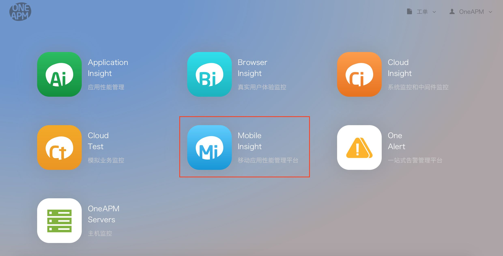
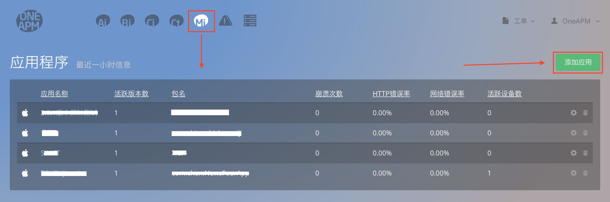
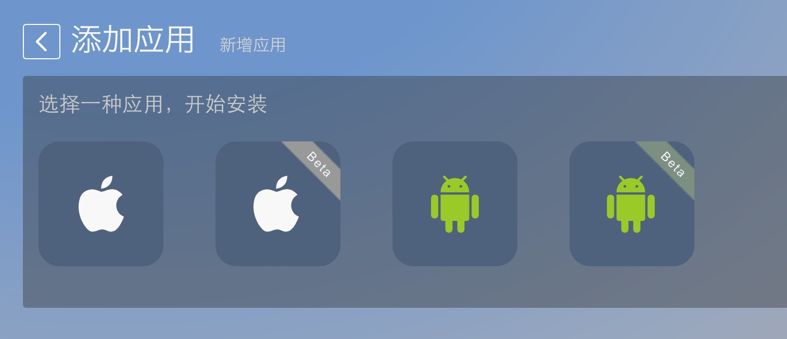

#新手入门
---
## 产品介绍
OneAPM 公司的 Mobile Insight 产品是专注于帮助开发者解决应用上线后性能问题的监控与管理。通过应用内嵌入 Mobile Insight 产品的 SDK , 同步真实用户访问体验,及时发现使用过程中的卡顿、崩溃、连接超时、内存泄漏等问题,帮助开发者第一时间终结用户流失。通过实时、多维立体的性能数据展现与自动分析,更能防患于未然,降低 App 上线后维护与迭代成本,直接提升用户留存率。

**Mobile Insight 共支持两种平台: iOS、Android**

## 版本分类

Mobile Insight分为SaaS免费版、SaaS付费版、企业级。

[相关权限及报价](http://www.oneapm.com/mi/price.html)

##使用流程
1.注册

首先您需要有一个OneAPM的账号:
[点击注册](http://user.oneapm.com/pages/v2/signup)

2.选择平台

登陆账号之后选择Mi(Mobile Insight)移动应用性能管理平台，进入应用列表管理界面。

3.添加应用

在应用列表页面，点击< [添加应用](https://mi.oneapm.com/mobile/app/setup#/) >按钮，进入下载安装页面。

4.安装集成

点击相应图标，选择您想要集成的Android/iOS SDK，根据步骤将SDK集成到您的项目中。

**注意：详尽安装集成步骤，请选择本帮助文档－使用平台查看。**

5.查看数据

成功集成之后，运行项目产生数据即可在OneAPM平台上查看应用的各项性能数据。

**注意：**
       * iOS崩溃数据必须在Release模式下真机测试并断开与Xcode的连接才能正常搜集到。
       * 安卓WebView数据需要配置之后才能正常使用。
       * 安卓集成中不同的编译器需要选择不同的插件。
       * 给应用取名获取的Token不能被应用到包名不同的应用程序中。
