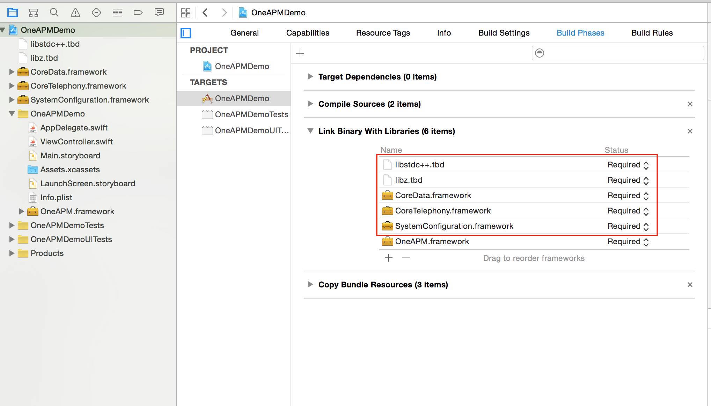

#OneAPM_iOS_SDK Swift 安装文档

##1. 注册 OneAPM

注册 OneAPM，登录账号后点击"Mobile Insight （移动应用性能管理）"，点击苹果图标进入下载安装页面。

您也可以根据本文的安装步骤进行安装。

##2.配置.framework形式开发包


####(1)下载并解压 OneAPM iOS SDK

下载最新版本的 iOS SDK:在[安装步骤页](https://mobile.oneapm.com/mobile/app/setup#/)选择应用类别，在“命名你的应用程序”输入项目名称，点击提交，记下随后出现的 Token。 

[OneAPM_iOS_SDK（Xcode6 及以下或者 App Bitcode 无效）](https://download.oneapm.com/ios_agent/iOS_SDK_latest_Xcode6.zip)

 [OneAPM_iOS_SDK（Xcode7 及以上并且 App Bitcode 有效）](https://download.oneapm.com/ios_agent/iOS_SDK_latest_Xcode7.zip)
 
####(2) 添加 OneAPM Framework 至 Xcode 项目中
解压 SDK，并将「OneAPM.framework」文件夹从 Finder 中拖拽至 Xcode 项目中（悬停至导航窗口的项目中）。

出现提示窗口时，选择「Copy items into destination...」和「Create folder references...」。


####(3) 在 Linker Settings 中添加以下 5 个 Libraries
在项目导航窗口内点击你的 Project，并选中你的 App，然后选择「Build Phases」选项卡。

打开「Link Binary with Libraries」列表。

点击添加:

- `SystemConfiguration.framework`
- `CoreTelephony.framework`
- `CoreData.framework`
- `libz.tbd` \ `libz.dylib (Xcode6及以前版本）`
- `libstdc++.tbd` \ `libstdc++.dylib (Xcode6及以前版本）`


##3.引入SDK

在Swift工程中新建.h文件，例如命名为ObjcBridgingHeader.h，在该文件中引入OneAPM头文件：  #import < OneAPM/OneAPM.h >

`
 import <OneAPM/OneAPM.h>
`


打开Swift工程的Build Settings设置界面，搜索Bridging Header，找到Objective－C Bridging Header设置项，添加上一步中创建的头文件，到此，在Swift工程中即可调用SDK接口。


在文件 AppDelegate.swift中添加如下代码，并确保它在 ```application:didFinishLaunchingWithOptions``` 的第一行中。
     
     ```[OneAPM startWithApplicationToken: @ "<use app token created at step 1>"];```

##4. 运行应用程序并使用
Clean Project，并重新在模拟器或设备中启动应用程序，开始应用性能管理。

`(注：开发时若要使用“崩溃统计”功能，请选Release模式在真机上运行)`

请静候 1分钟，等待应用程序向 OneAPM 发送应用程序性能数据，即可开始使用 OneAPM 应用性能管理功能。
##5. 符号化表（dSYM文件）上传
当应用列表可以显示出应用“包名”等信息后：

a.点击“崩溃”进入崩溃信息展示界面;

b.点击崩溃信息界面右上角“上传dSYM文件”按钮，选择APP版本号，选择要上传的dSYM文件"选取"，“保存”。
