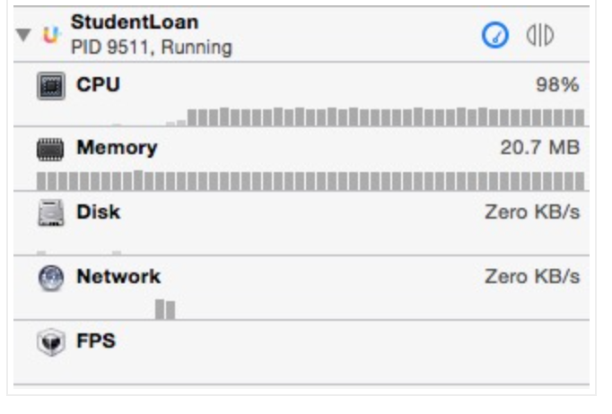
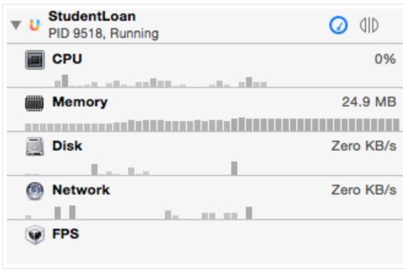

# Xcode 版本低于6.3，CPU 占用达到100%

##故障描述

当前最新的 Xcode 版本为6.3，我们最新的 SDK 是基于此版本进行开发的。若开发者的 Xcode 版本低于6.3，可能会出现 CPU 占用接近100%的情况，如下图。

##解决办法

此时，建议您将 Xcode 升级为最新版本，这样有助于您后期的项目开发。升级后再次查看，CPU 显示若如下图，则为正常。

