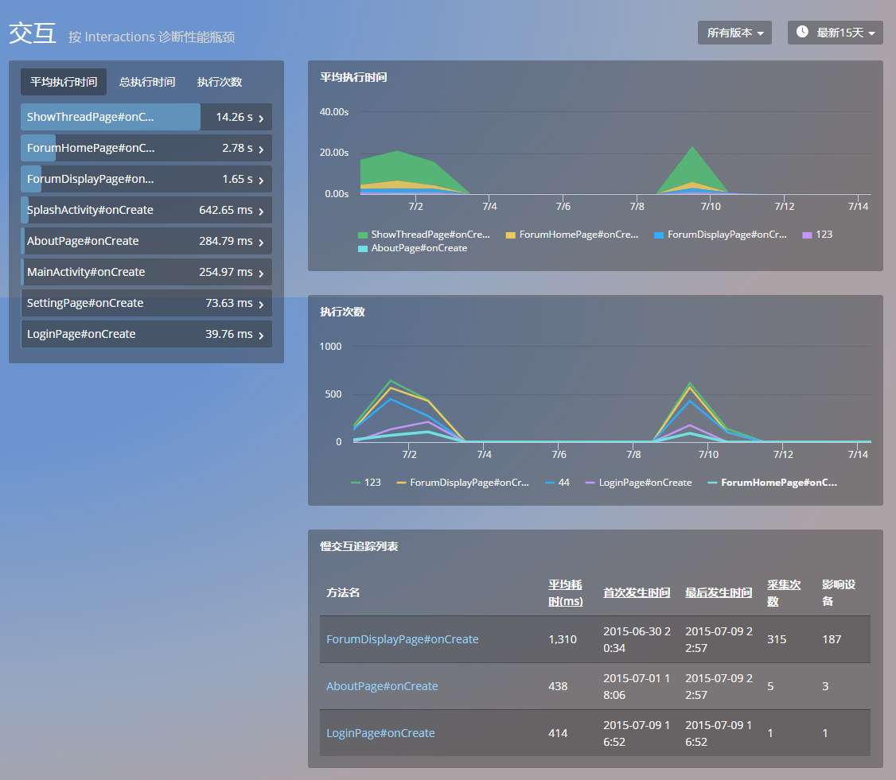
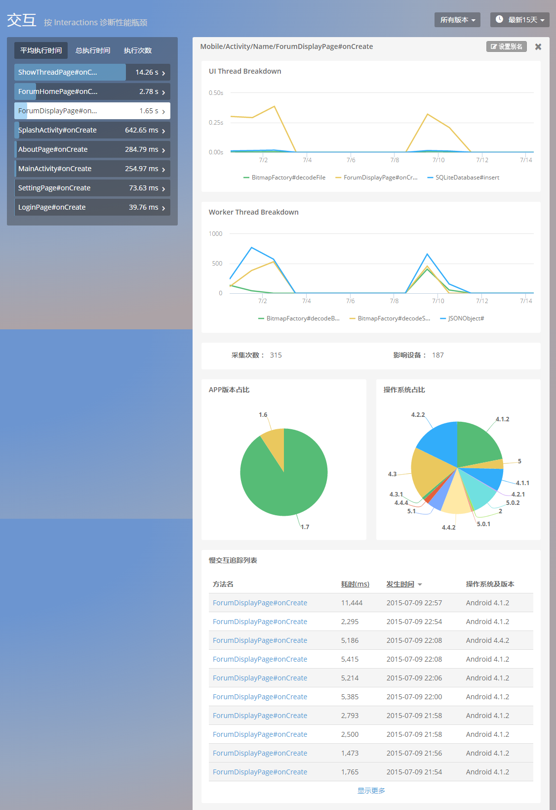
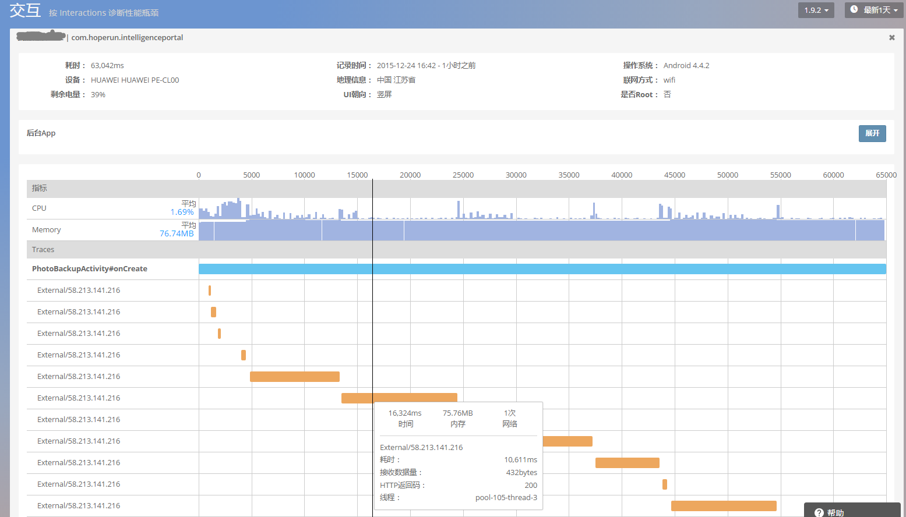

# 交互

交互功能用于监控终端用户与 App 交互时被调用代码的执行情况，用于分析发现耗时的用户交互。如图：

选择某个 Activity，查看该 Activity UI 主线程和 Worker 线程耗时状况。查看峰值，对执行次数最多，执行时间最长的线程进行优化。然后结合业务逻辑优化代码，尽量将耗时操作放在 worker 线程上，避免阻塞主线程进而影响用户体验。

点击慢交互列表中的任意交互名，可查看其详情：

