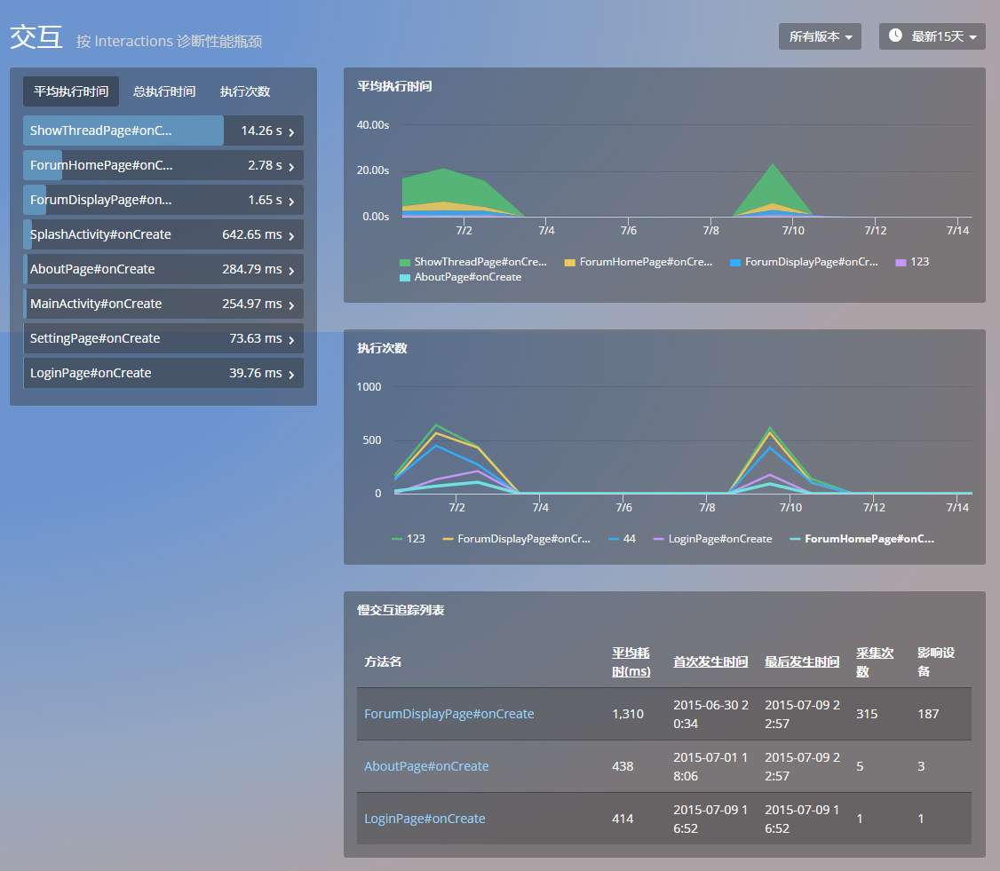
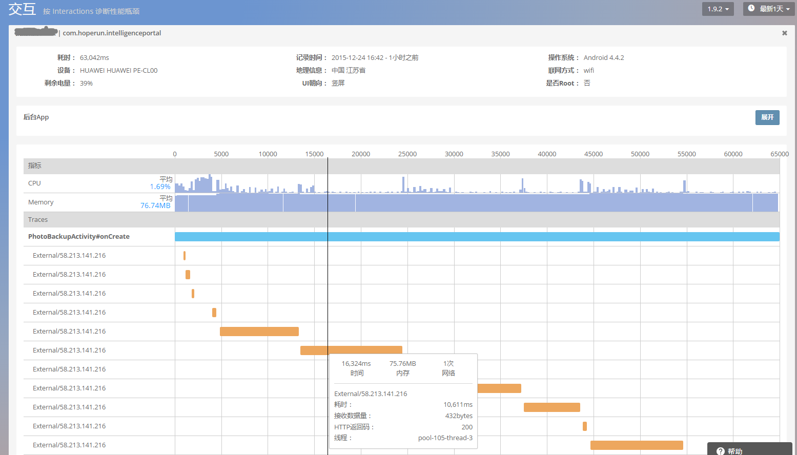

# 交互

交互功能用于监控终端用户与 App 交互时被调用代码的执行情况，用于分析发现耗时的用户交互。如图：

选择某个 Activity，查看该 Activity UI 主线程和 Worker 线程耗时状况。查看峰值，对执行次数最多，执行时间最长的线程进行优化。然后结合业务逻辑优化代码，尽量将耗时操作放在 worker 线程上，避免阻塞主线程进而影响用户体验。

点击慢交互列表中的任意交互名，可查看其详情：

- 在该页面中显示发生缓慢的某次交互中 CPU/memory 消耗状况，网络请求，异步线程的分布情况。

- 页面上方展示了，用户在操作该页面（Activity/View） 的时所使用的应用版本，设备操作系统，设备厂商，操作时间，所在地区，联网方式，剩余电量，UI朝向。

- 指标信息图则展示的是下方Trace时序图的堆叠形式，从内存堆叠图可以看出，该应用执行过程中内存释放情况。网络堆叠图可以看出同一时刻发生了多少异步网络请求，是否与最初设计的业务逻辑相符合。从而判断出造成某一时刻慢的原因。

- Trace 时序图是按照页面内线程加载顺序展示各个线程耗时情况，内存消耗，传输数据量等信息。

- 线程信息包括：Image，Database，Json,ViewLoading,Network 5类

- 主线程使用粗体标注，时序图中色块长度代表线程耗时时长。也可以帮助非开发该功能的程序员看清楚其中的逻辑关系，快速定位造成 Activity 慢的原因。

关键词：*交互 线程 CPU 主线程 UI线程*