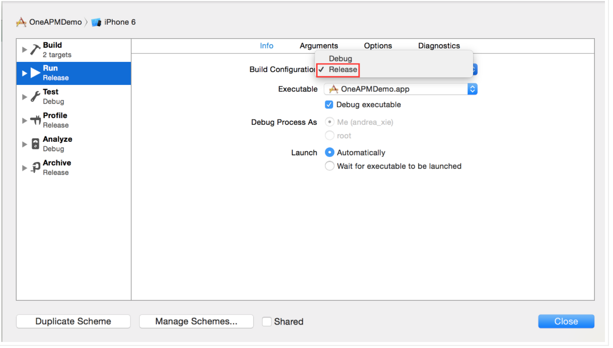
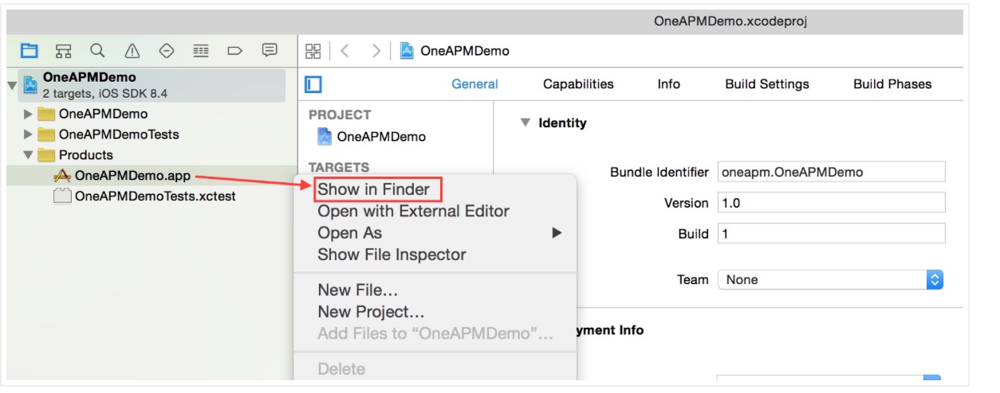
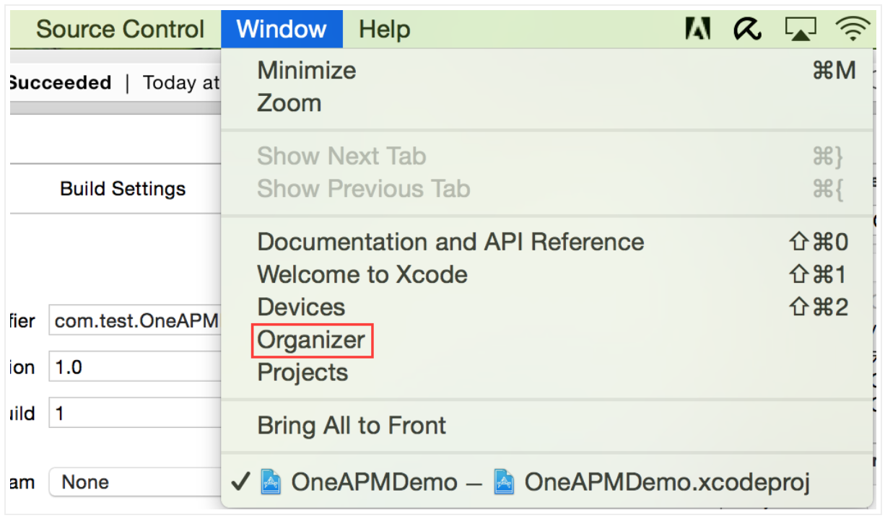
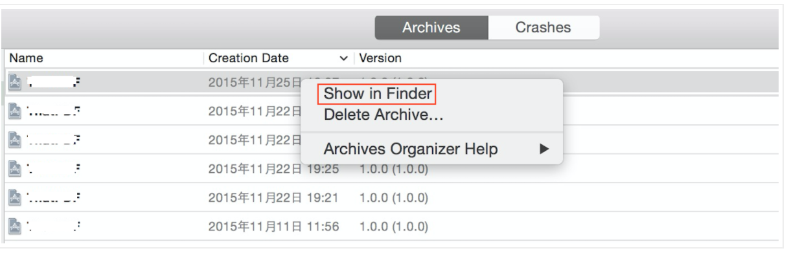
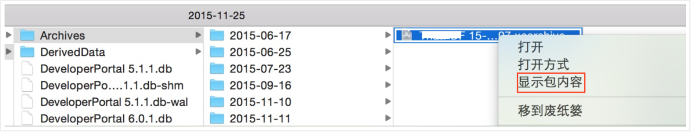
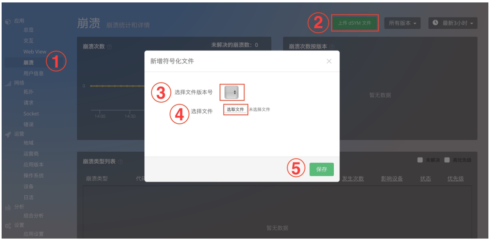

# 上传dSYM文件步骤

上传dSYM文件，分为 准备 和 上传 两大步骤：

步骤一：准备dSYM文件

（一）

打开工程，选择Edit Scheme

将工程由Debug模式转为Release模式,然后点击Close关闭弹框。

按住Command + B ,进行编译。

Xcode－“Products”下，右击XXX.app文件，选择“Show in Finder”，如下图所示：

与XXX.app同目录下，即可找到XXX.app.dSYM文件，如下图所示：

（二）Archive模式Build时：
选择Xcode－>Window－>Organizer,如下图所示：

在弹框中选择“Archives”选择对应APP右击，点击“Show in Finder”，如下图所示：

右击XXX.xcarchive文件，选择“显示包内容”，如下图所示：

进入dSYM目录下可以找到XXX.app.dSYM文件，接下来准备上传它。

步骤二：上传dSYM文件

浏览器登录OneAPM－Mobile 页面，https://mobile.oneapm.com/mobile/app#/

按照如下操作：

a.点击“崩溃”进入崩溃信息展示界面；

b.点击崩溃信息界面右上角“上传dSYM文件”按钮，选择APP版本号，选择要上传的dSYM文件"选取"

c.“保存”。

至此，dSYM文件已经上传成功，等待收集Crash数据吧！
 