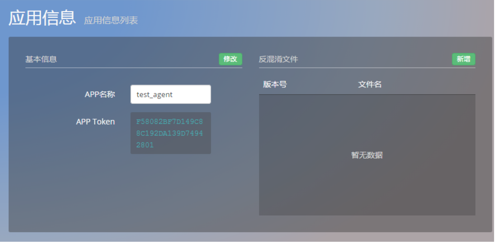
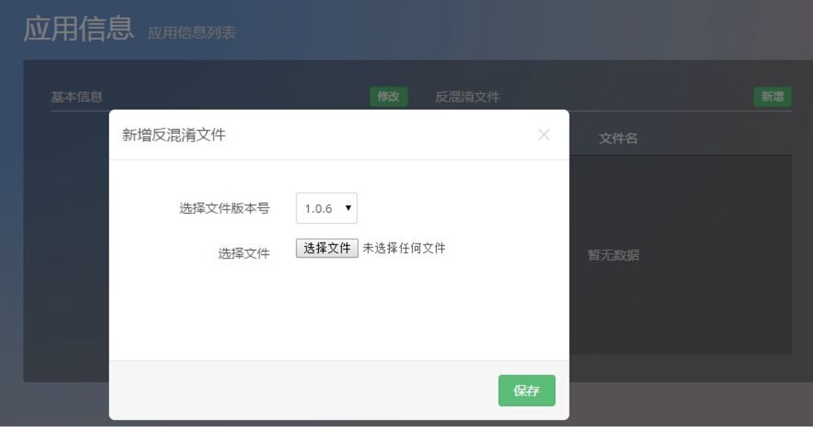
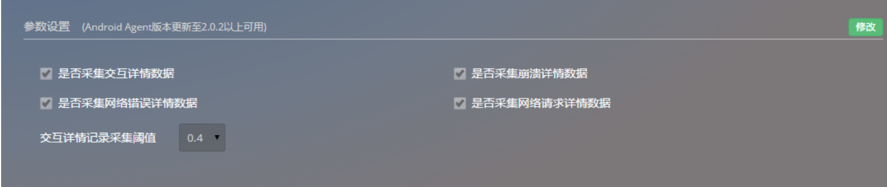

# 设置

## 1.**目录**
* 基本信息设置
* 参数设置

## 2.**基本信息设置**
该部分提供修改应用基本信息的入口，还允许用户上传反混淆文件，优化探针的数据分析准确度。关于反混淆文件：Android应用发布时，为了防止反编译，会进行混淆，导致探针抓取的数据是混淆后的数据，可读性不高。为此，本次更新开放一个入口，允许用户上传反混淆文件，用以翻译探针抓取的数据，以提升其可读性。

点击设置一栏下面的应用信息，便可上传该文件。

## 3.**参数设置**
该部分提供交互 trace、网络错误 trace、网络请求 trace、崩溃 trace的采集开关，您可以自主选择是否采集这些数据。默认情况下，所有数据均采集。
此外，您还可以选择交互trace的采集阈值。该默认值为0.4秒，即当交互执行时间超过0.4秒时，将视为慢交互予以记录。         
注：目前该功能只支持2.0.2版本以上的 Android 探针。

关键词：*设置  参数 反编译*

