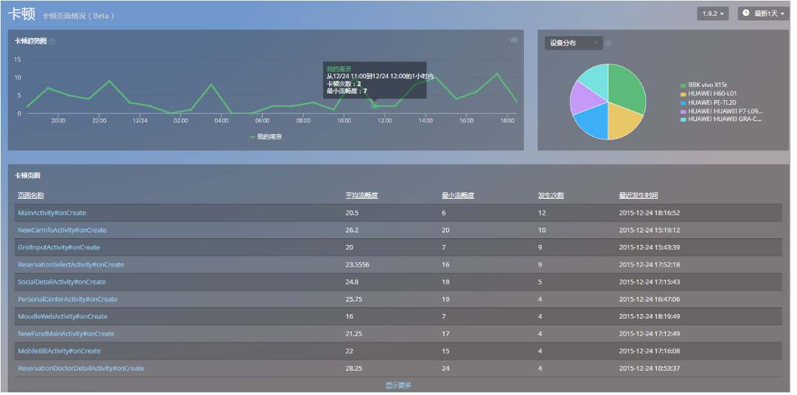
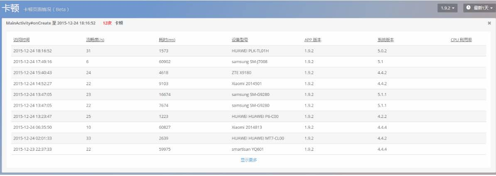
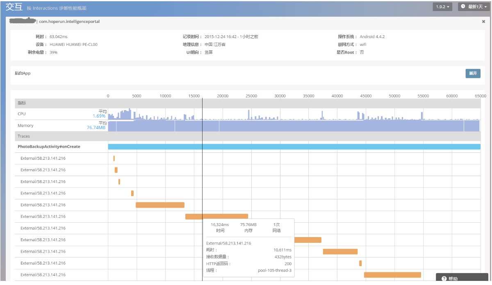

# UI性能-卡顿

>在手机App竞争越来越激烈的今天，App的各项性能，如CPU、内存消耗等都有了客观的衡量指标。但对于App使用过程是否流畅，一直没有一个可靠的指标将用户的客观感受和数据一一对应，Mobile Insight的卡顿可以直观地展示这些信息。

* 卡顿趋势图

*流畅度即1s中之内绘图刷新信号中断的次数。次数越接近40时，用户能感知到卡顿，帧率在20以下卡顿比较严重。我们采集流畅度小于40的数据绘制成曲线图，以此预测卡顿趋势状况。*

* 卡顿页面

卡顿页面包括页面名称、平均流畅度、最小流畅度、发生次数以及最近发生时间.

默认为线程执行时间超过0.4s且流畅度小于40，才会采集卡顿数据

卡顿详情列表展示：访问时间，发生卡顿时的流畅度，耗时，发生卡顿时的设备信息，APP版本，操作系统及版本，CPU信息

通过分析该页面信息可以清楚了解到卡顿来源，以便针对性优化

点击卡顿详情页的单条数据跳转至对应交互时序图，定位卡顿根因。

关键词：*卡顿 页面加载慢 CPU *
