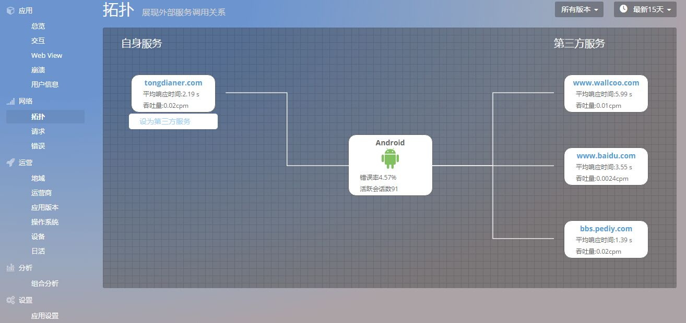
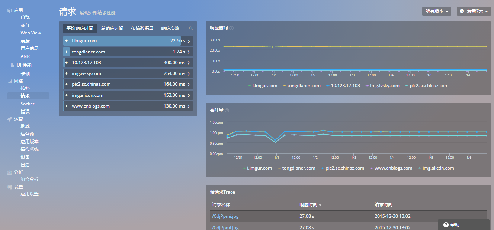
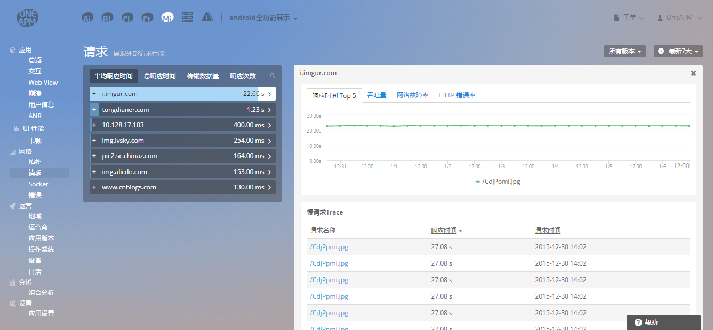
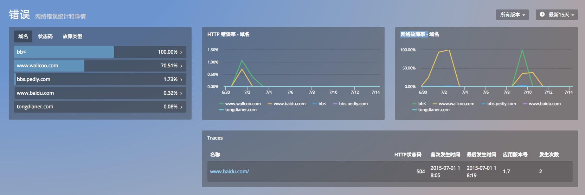
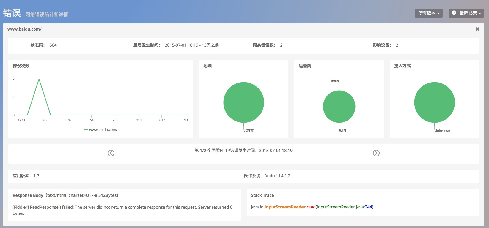

# 网络

> 针对移动 App 的网络监控，Mobile Insight 主要有以下功能：
* 拓扑
* 请求
* 错误

##1.  拓扑
「拓扑图」展示该应用的网络请求状况。显示 App 正在使用的服务，以及对应的平均响应时间、吞吐量等。默认情况下，左侧为自身服务、右侧为第三方服务。若您需要自主设定服务所属类别，将鼠标悬停在其图标上即可进行设置。
点击服务名称，可跳转到网络请求详情页面。

## 2. 请求
「请求」功能监测网络请求的性能和它们的响应时间可帮助提供提升移动用户体验的有用信息，该界面包含以下内容：
* 网络请求列表：按照平均响应时间、总响应时间、传输数据量、响应次数进行列表；
* 响应时间：展示网络请求平均响应时间 TOP 5 的时间曲线；该时间是指从发送 HTTP 请求开始，到收到所有响应内容的时间。
* 吞吐量：展示吞吐量 TOP 5 的时间曲线；吞吐量是指平均每分钟的 HTTP 请求数量。

此外，您可以利用请求列表中的搜索功能，快速检索您关心的网络请求。

点击「请求」列表的 URL，可查看对应的请求详细信息：响应时间、吞吐量、网络故障率、HTTP 错误率。

## 3. 错误
「错误」功能展示的是在 App 上发生的 HTTP 错误和网络故障，该界面包含以下内容：
* 错误统计列表：可以按照域名、状态码、故障类型三种方式对错误进行筛选排序。
* HTTP 错误率 ：HTTP 错误率最高的五个域名。
* 网络故障率 ：网络故障率最高的五个域名。
* 错误详情：通过 URL 名称和 HTTP 状态码识别为一个错误，并展示错误首次发生时间、最后发生时间、应用版本号以及发生次数，点击错误查看详情。

**错误详情**

详情页面展示了该网络错误次数的时间曲线、错误影响区域的占比、错误影响运营商的占比和错误影响接入方式的占比。
* 错误次数的时间曲线能告诉用户网络错误的趋势，在哪个时段最容易出现错误。
* 地域、运营商和接入方式均是与网络密切相关的指标。
* 地域占比能告诉用户应该特别注意哪个地区的网络性能。
* 运营商占比反映了哪家运营商的服务对自己的应用最友好。

如图所示，这是用户连接 WIFI 使用 App 时，发生了 HTTP 错误。
此外， HTTP 错误归类滚动追踪轴，可以查看单次 HTTP 错误的详情。当 App 上线后，短时间内的 HTTP 错误可能多达上百条，不易查看。将同类信息合并，可以快速发现关键问题。而需要查看细节时，也可以滚动追踪轴，查看每条记录。

关键词：*拓扑 请求 错误 *

