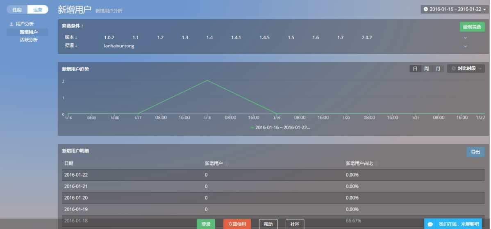
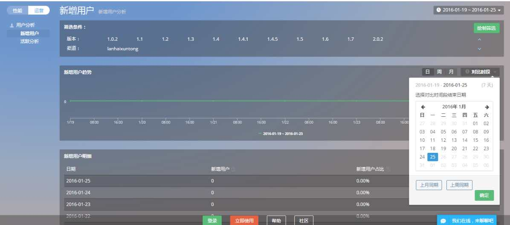
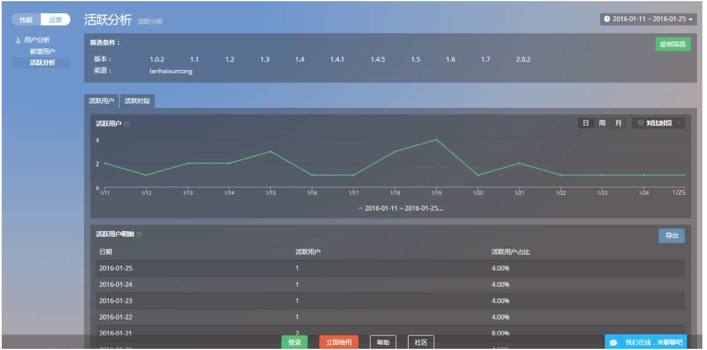
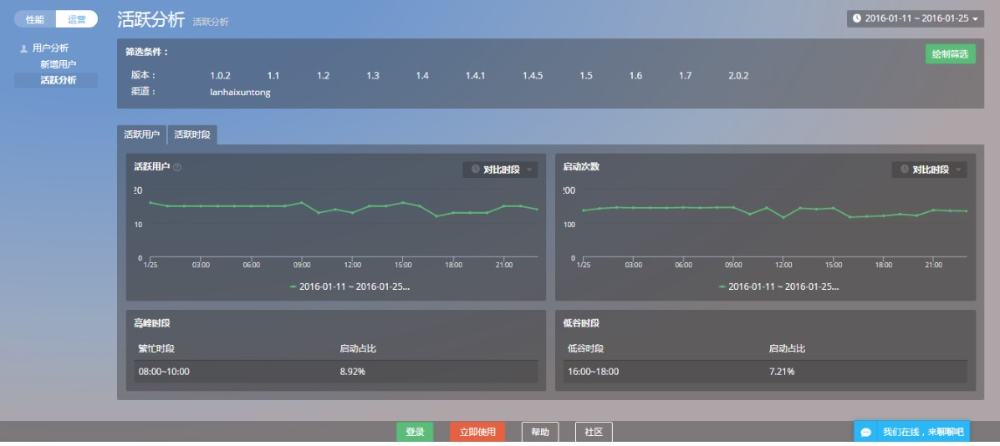

# 用户分析
* 新增用户
* 活跃分析

## 新增用户

按照版本号、渠道和日期三个筛选条件进行交叉筛选绘制新增用户趋势图，方便您从整体掌控应用的运营情况及增长动态。

新增用户为第一次启动应用的用户（以设备为判断标准），按日，周，月查看数据并且可进行版本，渠道的交叉筛选。

对比时段，对比你所关心时间的数据：点击新增用户趋势报表的“对比时段”可对所选时段的数据做上周同期以及上月同期数据对比。

新增用户明细：展示所选日期范围内新增用户与新增用户占比信息

新增用户占比：某时段内新增用户占该时段活跃用户的比例

根据需要您可以点击导出按钮导出报表

## 活跃分析
按照版本号、渠道和日期三个筛选条件进行交叉筛选绘制活跃用户趋势图，活跃用户是指当日有使用应用（至少启动一次）的用户数。

活跃时段分析呈现的是在选定时间段内总的用户启动次数，以及活跃用户数，分别所占的时间区间段。在此可以清楚的了解到用户使用应用时间区间，在高峰时段我们建议您可以做一些推广活动，同时支持自选时间段数据比对。

高峰时段/低谷时段：根据选定的时间段，系统计算出繁忙时间段，低谷时间段，以及启动占比。便于用户判断，APP受用群活跃特征，针对此特征做相应的活动策划或制定相应策略。

活跃用户明细：展示所选日期范围内活跃用户与活跃用户占比信息，其中活跃用户占比= 活跃用户/所选时段内的活跃用户总数（不去重）。根据需要您可以点击导出按钮导出报表

 *关键词：活跃用户 用户分析 *

