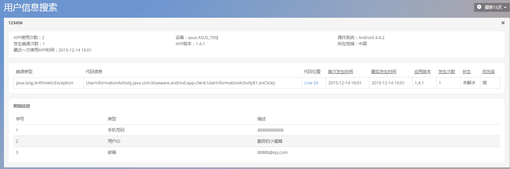

# 用户信息


- 通过搜索关联用户信息，得到该用户使用APP时设备的崩溃次数，以及崩溃详情。
- 查看某类崩溃影响的用户信息列表。

*注意：用户信息模块崩溃查询功能以及崩溃模块影响用户列表只在付费后可使用或查看。*

该模块提供查询单个用户发生的崩溃信息的入口。


此外，通过设置用户识别信息，您可以自定义收集用户信息。
我们提供的接口如下：

* IOS 配置用户信息


```+ (void)setCustomInfo:(NSString *)info;```

*备注：setCustomInfo 内容长度为200字节，即100个汉字长度，超过部分会被截取。*

用法示例：

>```[OneAPM setCustomInfo:@"18611421164"];```

>```[OneAPM startWithApplicationToken:@"225D3C244ACE5E49F1CFA920EF94D8A489"];```

* Android 配置用户信息


 ``` ContextConfig contextConfig = new ContextConfig();```
 
 ``` contextConfig.setSearchField("user_imsi_custom");```
 
 
*参数配置：*


HashMap<String,String> extraData = new HashMap<String, String>();

extraData.put("手机号码","");
 
extraData.put("用户ID","");
 
extraData.put("邮箱","88888@qq.com");
 
contextConfig.setExtra(extraData);


### 按照上传信息查询用户崩溃情况


如图，在输入框中键入用户信息，可以查询单个用户发生崩溃的信息。


查询结果包括：用户信息，用户使用的设备信息，APP版本以及崩溃开始时间。


### 查看崩溃详情

点击单条信息，可查看发生崩溃时用户所处的环境：



点击崩溃列表中的崩溃名，可跳转至崩溃详情页：


关键词：*崩溃 影响用户 用户信息*
