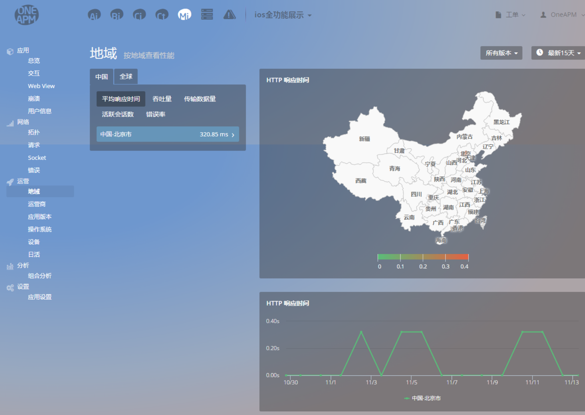
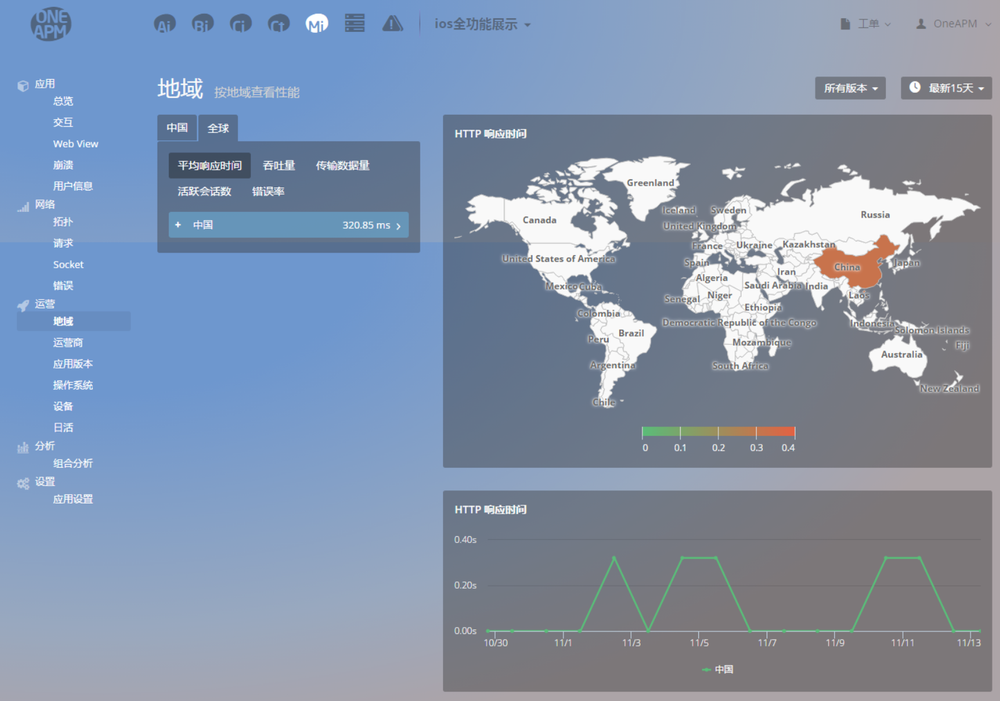
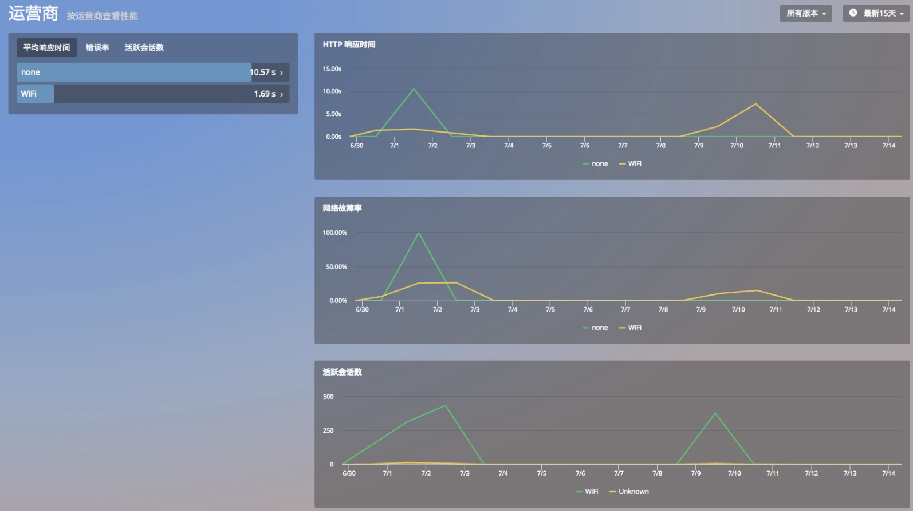
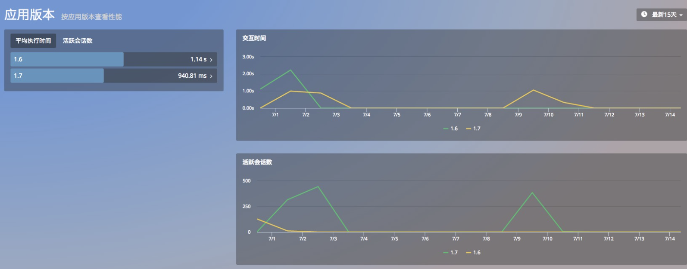
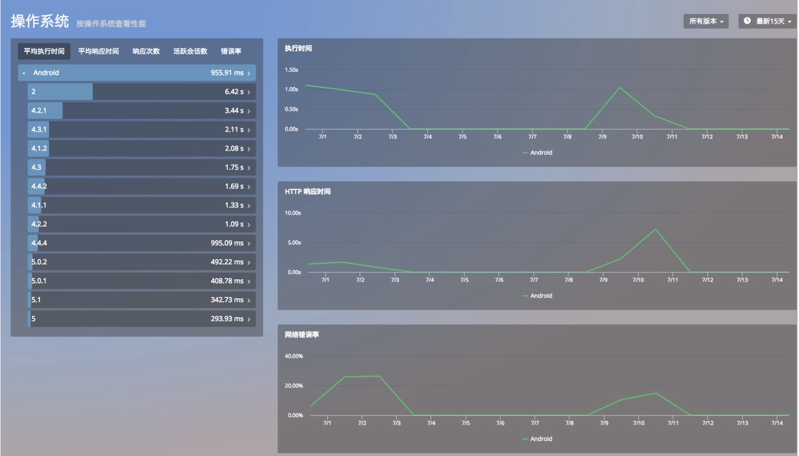
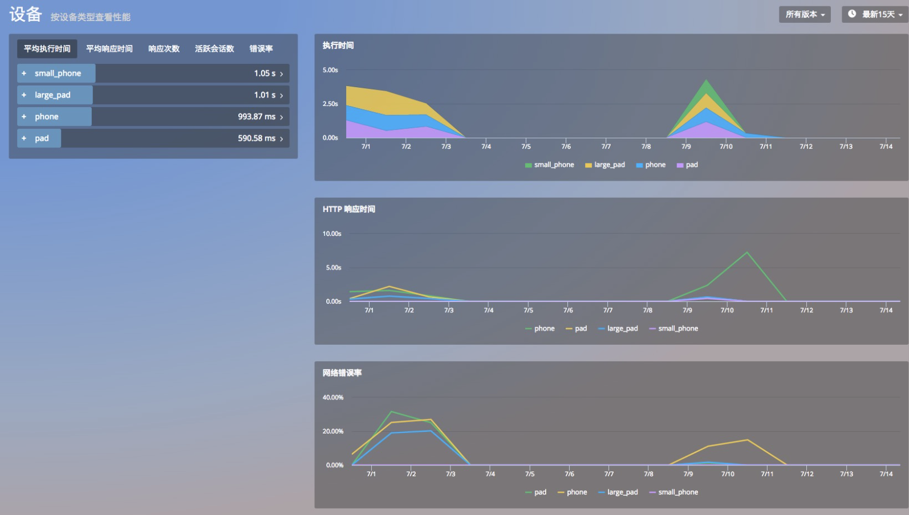
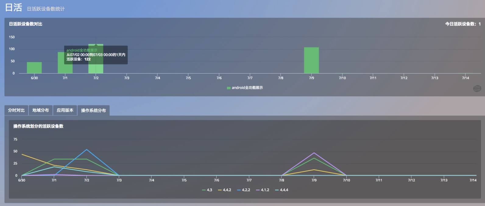

# 运营

> App 上线后，通过OneAPM丰富的运营数据，用户可以定制更加智能的应用优化策略，该模块包括以下功能：
* 地域
* 运营商
* 应用版本
* 操作系统
* 设备
* 日活

## 地域
该功能通过「地域」这个维度，显示App在全国以及全球不同地域的性能表现。
* 列表：可通过平均响应时间，吞吐量，传输数据量，活跃会话数，错误率选项对列表进行重新排序。点击一个具体的省市，可以查看对应的性能指标。

* HTTP 响应时间地图：以地图的方式显示 App 在全国不同省市的 HTTP 响应时间。

* HTTP 响应时间折线图：以折线图的方式显示 App 在全国不同省市的 HTTP 响应时间。

点击的“全球”选框卡，您可以查看应用在世界范围内的运行情况。

## 运营
在这个界面，您可以查看 App 接入网络的不同方式，比如：WIFI、移动 3G、联通 4G 等方式。
* 运营商列表：可按照平均响应时间、错误率、活跃会话数进行重新排序。
* HTTP 响应时间：查看 App 在以不同接入方式时接入网络时的 HTTP 响应时间。
* 网络故障率：显示某一运营商在此时间范围内的错误率、错误次数、错误总次数。
* 活跃会话数：显示某一运营商在此时间范围内的活跃会话数。
在运营商列表中，选择具体一个运营商可以查看对应的性能数据。

## 应用版本 
在发布多个版本的App后，您可以在「应用版本」这个功能查看不同版本 App 的交互时间和活跃会话。在应用版本列表中，选择具体一个版本可以查看对应的性能数据。

## 操作系统
当 App 的用户量不断增加后，您可以通过该功能了解用户使用的操作系统分布情况，也可以通过该功能了解App在不同操作系统上的性能表现。提供的性能数据有：
* 执行时间：页面平均执行时间。
* HTTP 响应时间：发送HTTP请求开始,到收到所有响应内容的时间网络错误率：网络错误数量与请求数量的比率。其中发生网络错误的HTTP请求数指发生DNS解析错误、无法建连、连接超时等网络方面的错误的数量。
* 活跃会话数：用户交互过程中每个App终端每分钟与服务器的连接次数。

## 设备
随着 App 用户量不断增加，您可以通过该功能了解用户使用的设备分布情况，也可以通过该功能了解App在不同设备上的性能表现。提供的性能数据有：
* 执行时间：页面平均执行时间。
* HTTP 响应时间：发送HTTP请求开始,到收到所有响应内容的时间网络故障率：网络错误数量与请求数量的比率。其中发生网络错误的HTTP请求数指发生DNS解析错误、无法建连、连接超时等网络方面的错误的数量。
* 活跃会话数：用户交互过程中每个App终端每分钟与服务器的连接次数。

## 日活
「日活」功能显示15天的每日活跃数据，方便您轻松对比15天的 App 运营数据。
* 日活跃设备数对比：展示15天内,每日活跃设备数对比统计图。
* 分时对比：对比同一段时间，今日，昨日，7天前,15天前活跃设备数。
* 地域分布：展示活跃设备数TOP5地域随时间的推移的活跃设备数的对比趋势信息。
* 应用版本：按 App 版本，统计 15 天内活 跃用户数趋势与对比。
* 操作系统分布：按照操作系统，统计15天内活跃用户数趋势。

关键词：*运营 日活 操作系统 地域 *