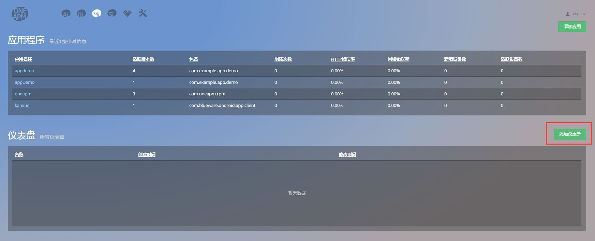
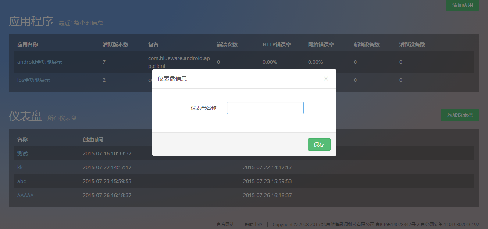
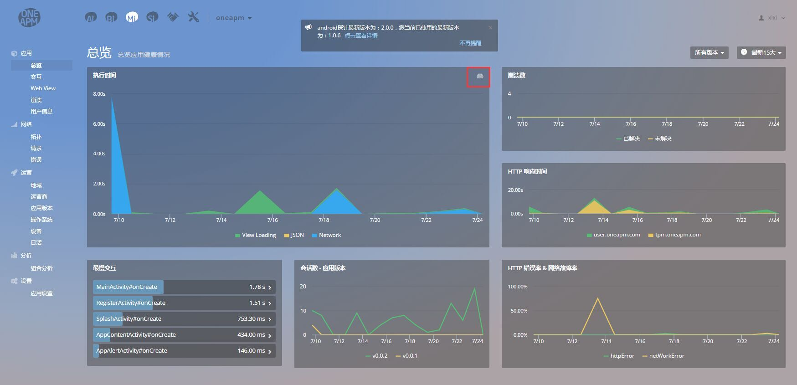
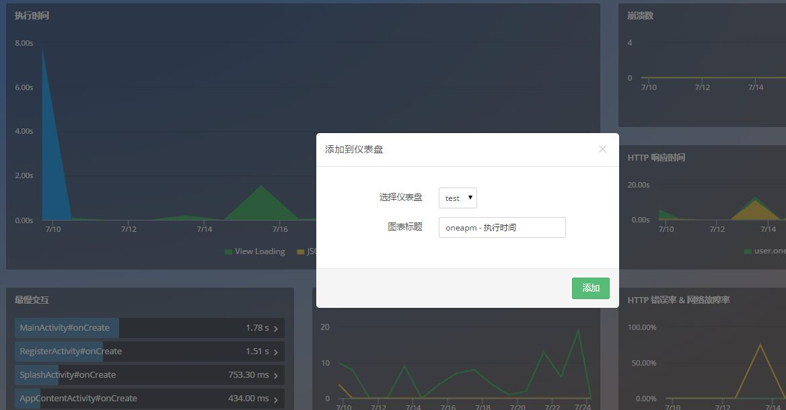
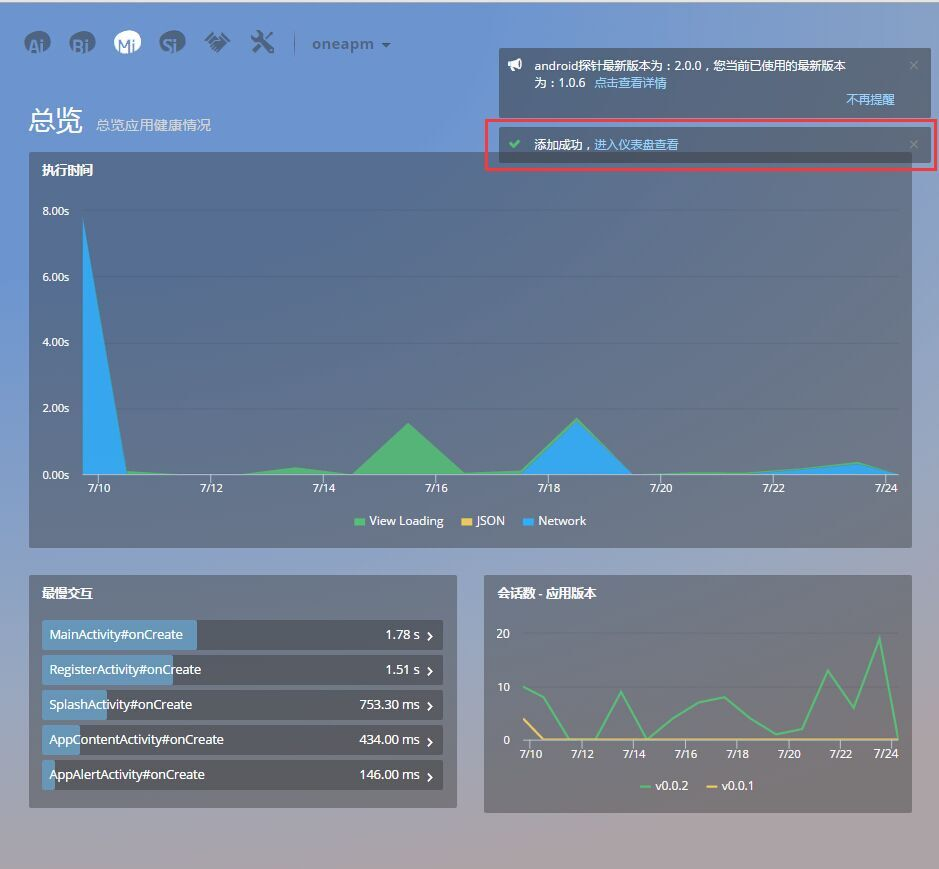
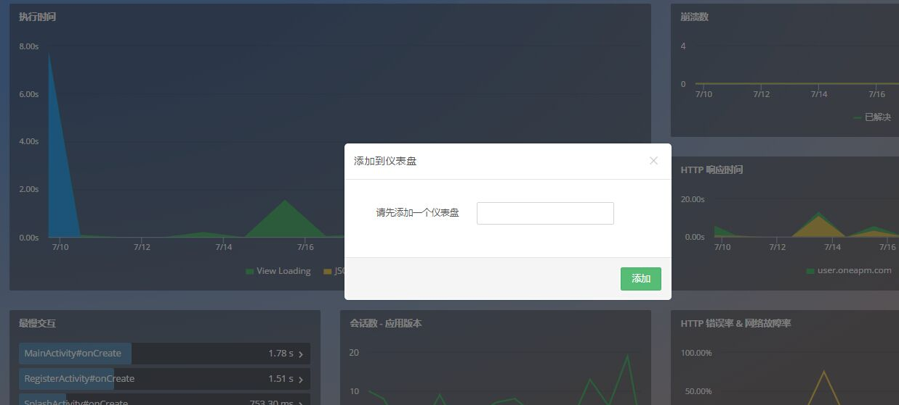
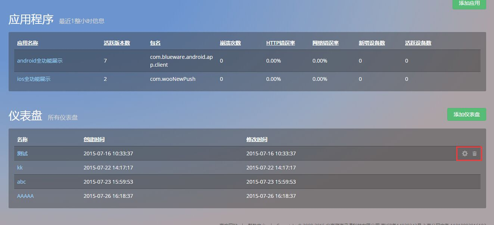
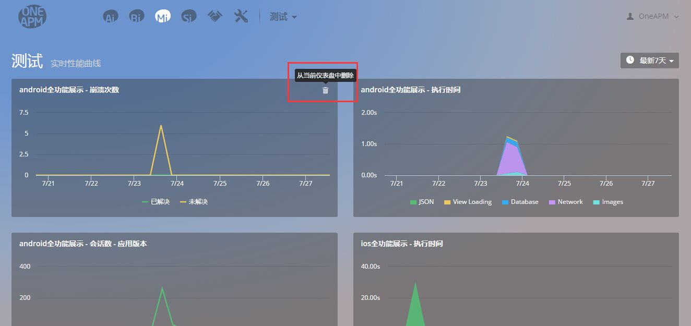

# 自定义仪表盘

借助该功能，您可以个性化创建仪表盘，并为其添加想要监控的动态图，从而更有针对性地监控应用性能变化。

## 目录
* 创建自定义仪表盘
* 为仪表盘添加动态图
* 删除仪表盘
* 删除动态图

## 创建自定义仪表盘
在 Mobile Insight 首页，点击“添加仪表盘”按钮，可直接创建仪表盘。

如图，输入名称，点击“保存”即可。注，每个账户至多可添加五个仪表盘。

## 为仪表盘添加动态图
在应用功能界面，鼠标悬浮在想要添加至仪表盘的动态图右上角，会出现仪表盘图标。

点击之后，选择添加的仪表盘，修改名称后点击添加即可。注，每个仪表盘至多可添加八张动态图。

添加完成之后，系统提示添加成功，并给出跳转至相关仪表盘的链接。

若此时没有创建好的仪表盘，系统会提示先添加一个仪表盘。

添加成功之后，后续操作不变。

## 删除仪表盘

如图，鼠标悬浮在仪表盘列表右侧，出现修改仪表盘名称或删除仪表盘符号。

## 删除动态图

如图，鼠标悬浮在动态图右上角，出现删除动态图符号。

